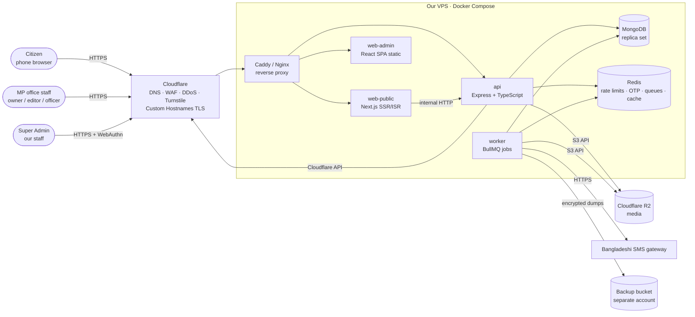
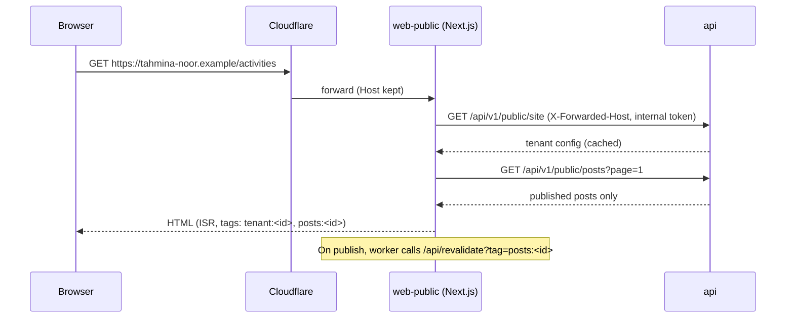
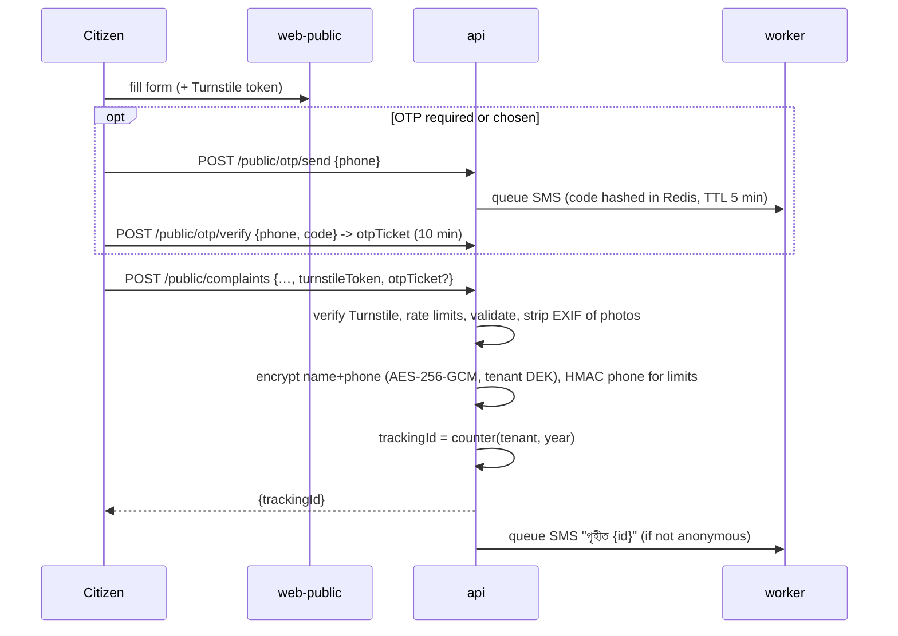

# Jonoprotinidhi (জনপ্রতিনিধি) — Handoff bundle
Generated 2026-09-30 by scripts/build-bundle.py. Upload this single file to a claude.ai Project as knowledge, then use section 2 of KICKOFF_PROMPT.md.
Contents: CLAUDE.md, KICKOFF_PROMPT.md, HANDOFF.md, docs/00-START-HERE.md, docs/01-PRD.md, docs/02-ARCHITECTURE.md, docs/03-DATA-MODEL.md, docs/04-API.md, docs/05-DESIGN-PATTERNS.md, docs/06-UI-UX.md, docs/07-TASKS.md, docs/08-SECURITY.md, docs/09-BUILD-BRIEF.md, adr/0000-template.md, adr/0001-multi-tenant-platform.md, adr/0002-mern-stack.md, adr/0003-tenant-isolation.md, adr/0004-complainant-pii-protection.md, adr/0005-content-approval-workflow.md, adr/0006-domains-and-tls.md, adr/0007-complaint-otp-optional.md, adr/0008-content-and-legal-guardrails.md, adr/README.md.
The runnable demos live in `client-demo/` (not included here, only listed at the end). They are the visual and UX spec: fetch them from the repository.


==============================================================================
<!-- FILE: CLAUDE.md -->
==============================================================================

# Jonoprotinidhi (জনপ্রতিনিধি) — Claude context

Portfolio + CMS + citizen complaint platform for Bangladeshi MPs/ministers (multi-tenant, run by the user's company).

- **Read `HANDOFF.md` first** (owner's project log, English), then **`docs/00-START-HERE.md`** and the kit in `docs/01..08` + `adr/`.
- Reply to the user in **Bangla**. Code, commits and docs in English; UI copy in Bangla.
- **Decisions already made** (see `adr/`): one multi-tenant platform we host; **MERN** (Express + Mongoose API, React admin SPA, Next.js public sites); tenant isolation via fail-closed `tenantId` plugin; complainant PII encrypted, assigned-officer-only; Draft → Review → Publish with owner approval; complaint OTP optional (mandatory per tenant on request). Don't re-open without the owner.
- Never put invented activities/news/stats/quotes under a real politician's name; full-content demos use the fictional MP in `client-demo/demo-mp/`. No real MP site without written office consent.
- Product code **exists** (first vertical slice): `apps/api` (Express+Mongoose), `apps/web-admin` (React SPA), `packages/shared` (zod schemas, permissions). Run: `npm install`, `npm run seed`, `npm run dev:api`, `npm run dev:admin`. Test: `npm test`, `npm run typecheck`, `bash e2e/run.sh`. Seed credentials are in git-ignored `apps/api/.seed-credentials.local` (never paste them in chat). `client-demo/` remains the visual/UX spec (static, no backend).
- **Bug tracking:** every defect goes into `bugs/register.json` via `node scripts/bugs.mjs` (RPN = S×O×D, see `bugs/README.md`); each fix needs a regression test that mentions the bug ID; `npm run bugs:check` must pass; open P0/P1 blocks release.
- **2-step login is a switch:** `MFA_REQUIRED` in `apps/api/.env` (default `true`). Local `.env` has `false` (owner asked, 30 Sep 2026) so login is password-only; the API refuses to start with `false` in production. `e2e/smoke.py` needs `MFA_REQUIRED=true`. Turn it back on before any real client/pilot.
- **Media + rich text:** post `body` is sanitised HTML (`apps/api/src/lib/richtext.ts`, allow-list; length limit counts visible text via `packages/shared/src/richtext.ts`). Uploads go through `apps/api/src/lib/media.ts` (sharp re-encode to WebP, EXIF stripped, SVG/GIF refused, 40 MP cap) into `MediaStorage`; URLs are built by `lib/mediaUrl.ts` and only own-tenant upload URLs or `MEDIA_HOSTS` are accepted in posts/banners. Admin UI: `components/RichEditor.tsx` (Tiptap), `ImagePicker.tsx`, `RichText.tsx` (DOMPurify on read). New tenant routes must be added to the isolation crawler table.
- **Public site** `apps/web-public` (Next.js 14, React 18, port 3000): renders only from the public API; tenant from Host (dev fallback `TENANT_HOST`). It sends `X-Site-Token`/`X-Client-IP` (shared `SITE_SERVER_TOKEN` in both `.env` files) so rate limits stay per visitor. Every visible text must come from the CMS.
- **CMS content model:** `packages/shared/src/content.ts` (page keys + zod schemas, events/gallery/videos, `parseYouTubeId`); services `apps/api/src/services/{pages,collections,media}.ts`; admin editors in `apps/web-admin/src/pages/tenant/content/`; design system rules in `apps/web-admin/DESIGN.md`. Build brief for parallel agents: `docs/09-BUILD-BRIEF.md`.
- **GitHub:** PUBLIC `mdfrhd101/jonoprotinidhi` (owner made it public 30 Sep 2026), branch `main` — every push is world-readable. Commit messages must NOT contain a `Co-Authored-By: Claude` (or any AI attribution) trailer (owner request). Never commit `.env*`, `.seed-credentials.local`, uploads, `client-demo/mirza-abbas/`; scan for secrets before every push.
- Test gotchas: tenant-scoped models need `runInTenant` (await inside it); rate limits are disabled in tests unless `setDisabled(false)`; e2e needs a reseed (`SEED_RESET=1`) each run.
- Demo preview: `python -m http.server 8765 --bind 127.0.0.1 --directory client-demo` → `http://localhost:8765/demo-mp/` (public site) and `http://localhost:8765/admin/` (Super Admin + MP Admin panels; they share localStorage with the public site).
- Security rules that apply to all code: every tenant query scoped; no PII in logs; no secrets in git; audit every admin write (`docs/05`, `docs/08`).
- Update the dated header and "9. What has been built so far" / "10. Next steps" sections of `HANDOFF.md` (written in English) whenever work is done; keep docs in sync and regenerate `HANDOFF_BUNDLE.md` (`python scripts/build-bundle.py`).


==============================================================================
<!-- FILE: KICKOFF_PROMPT.md -->
==============================================================================

# Kickoff prompts — Jonoprotinidhi (জনপ্রতিনিধি)

Copy one of these as the **first message** in a new Claude session. Replace the bracketed parts.

---

## 1. Claude Code (repo is on your machine)

```
Read CLAUDE.md, then docs/00-START-HERE.md, HANDOFF.md, and skim docs/01..08 and adr/.
You are joining the Jonoprotinidhi project (multi-tenant MP portfolio + CMS + complaint platform, MERN,
decisions already made in adr/). Reply to me in [Bangla | English].

Before writing code:
1. Summarise in 10 lines what we are building, the current state, and the decisions you must not re-open.
2. Tell me which milestone/task in docs/07-TASKS.md you will start with and why.
3. List any question that genuinely blocks you (max 3). Do not ask about things already in the docs.

Then work on task [T0.1 / next open task]. Rules:
- Follow docs/05-DESIGN-PATTERNS.md. Every tenant model uses the tenantScoped plugin; complainant PII
  follows ADR-0004. If a change would break a rule, stop and ask.
- Write tests with the code (isolation and PII suites are mandatory where relevant).
- Use a branch named feat/<task-id>-<slug>; small commits.
- When done, update HANDOFF.md (dated entry) and any doc you changed, then show me what to run to verify.
```

## 2. claude.ai (chat / Project)

1. Create a **Project** named "Jonoprotinidhi".
2. Upload `HANDOFF_BUNDLE.md` as project knowledge (it contains CLAUDE.md, HANDOFF.md, docs 00–08 and the
   ADRs in one file). Regenerate it after doc changes: `python scripts/build-bundle.py`.
3. First message:

```
You are joining the Jonoprotinidhi project. The project knowledge contains the full handoff bundle. Read it all.
Reply in [Bangla | English].

Give me: (a) a 10-line summary of the product, current state and fixed decisions, (b) the next 3 tasks
from the task list with acceptance criteria, (c) up to 3 blocking questions.
Then help me with: [describe today's goal].
When you write code, give complete files with paths relative to the repo root, following the patterns in
the design-patterns section. Never invent facts about real politicians.
```

## 3. Useful follow-up prompts

**Implement a task**
```
Implement task [T2.2 Posts CRUD + state machine + versions]. Show the plan first (files, models, routes,
tests). Then implement. Include the tenant-isolation test and the permission tests. Update docs/04-API.md
if the contract changed.
```

**Review a pull request**
```
Review this diff against docs/05-DESIGN-PATTERNS.md and docs/08-SECURITY.md. Check specifically: tenant
scoping, PII exposure, permission checks, audit entries, input validation, missing tests. List findings by
severity with file and line.
```

**Security pass on a feature**
```
Run a security review of [feature] using docs/08-SECURITY.md (STRIDE table, controls checklist, misuse
cases in docs/01-PRD.md §5). Output: risks, missing controls, tests to add.
```

**New MP onboarding checklist**
```
Prepare the onboarding checklist for a new MP client using client-demo/MP_INFO.md and ADR-0008: consent
document, content intake, photo licences, domain, first-week posting plan. Do not invent any activity or
statistic; leave unknowns blank.
```

**Update the handoff**
```
Append a dated entry to HANDOFF.md (what was done, files touched, decisions, what is next), sync any changed
doc, and regenerate HANDOFF_BUNDLE.md.
```

---

## Ground rules for every session

- Bangla for talking to the owner; English for code, commits and docs; UI copy in Bangla.
- Never put invented content under a real politician's name (ADR-0008).
- Never commit secrets; use `.env.example`.
- Demos in `client-demo/` are the visual spec: run them with
  `python -m http.server 8765 --bind 127.0.0.1 --directory client-demo`.
- Open questions belong to the owner: party colour/symbol policy, first real client and consent, hosting and
  pricing, SMS gateway, production domain.


==============================================================================
<!-- FILE: HANDOFF.md -->
==============================================================================

# Jonoprotinidhi (জনপ্রতিনিধি) — Portfolio and public-engagement platform for MPs and ministers
### Handoff document · last updated: 30 September 2026 (new admin design, full CMS, public website, GitHub)

> To continue this work on another PC or with another Claude, read this whole file first.
> Tell Claude: **"Read HANDOFF.md and continue from the 'Next steps' section. Talk to me in Bangla."**
> The name "Jonoprotinidhi" (জনপ্রতিনিধি) was chosen on 30 Sep 2026 (previously "Jonoshetu").

---

## 1. The project at a glance

A **portfolio website + CMS + citizen complaint box** for Bangladeshi Members of Parliament (MPs) and ministers. It is one
platform that we (the owner: the user's company) will offer to many MPs as a service.

- **Goal:** raise the MP's public image — through real work, transparency and accountability, never exaggeration.
- **Every MP site has:** profile (personal, education, profession, political life), responsibilities, regular activities,
  an account of election promises, constituency information, gallery, videos, complaint box, contact.
- **The home page has:** banners/posters, photos and videos of activities. The home page is full of content.

## 2. Business structure (the user's decision)

```
Super Admin (our company)
   │  creates / assigns MP accounts
   ▼
An admin panel is created automatically for every MP
   │
   ├─► The MP's public site: on our subdomain, or later on the MP's own custom domain
   └─► Super Admin can enter any MP's site and fix any content or problem
```

- MPs will not understand anything technical. Backend, hosting and domains stay with us.
- **One multi-tenant platform** (not one server per MP). Each MP's data is strictly separated (tenant isolation) so one
  MP's data never reaches another. MPs of rival parties may be on the same platform.
- Custom domains are added from the Super Admin panel (host → tenant routing).
- When Super Admin changes anything on an MP's site, it goes into the **audit log**: who, when, what.

### Roles
| Role | What they can do |
|---|---|
| Super Admin (us) | All MPs, all sites, domains, backups, fix any content |
| MP / minister (owner) | Own dashboard, approve and publish content |
| PR / content editor | Write posts and page content, upload photos/videos, send for approval |
| Complaint officer | See and resolve only the complaints of their own area |

## 3. Public website structure (final: separate pages)

> The user's explicit instruction: **no single-page site.** Every topic gets its own page. Content is detailed, not "very
> short". All of the MP's information is in one place. **The complaint box is not on the home page but on its own page.**

| Page | Route | Content |
|---|---|---|
| **Home** | `/` | Banner slideshow (MP photos, auto-advance every 3 s), name/title/slogan, work in numbers, recent activities, promise summary, constituency overview, gallery and video sliders, upcoming events, complaint call-to-action |
| **About** | `/about` | Personal facts, education, profession, political life, parliamentary role and numbers, priorities, awards, publications, portrait |
| **Biography** | `/biography` | Full timeline of education, profession and politics (the About page shows only a summary and a link) |
| **Activities** | `/activities` | All activities, filters by topic / upazila, pagination |
| **Activity detail** | `/activities/[slug]` | Full story (rich text), date, place, quote, photo album, related activities |
| **Election promises** | `/promises` | Promises by sector with budget, deadline, progress and updates; delays shown with their reason |
| **Constituency** | `/area` | Per-upazila population, voters (male/female/third gender), area, literacy, institutions, unions, offices |
| **Gallery** | `/gallery` | Photo slider with thumbnails, album chips, photo wall and lightbox |
| **Videos** | `/videos` | Video slider (video + title), grid; YouTube links and uploaded videos |
| **Complaint box** | `/complaint` | Submit, track, monthly statistics, process, FAQ |
| **Contact** | `/contact` | Offices (address, hours, phone), upcoming events, social links |

Every page has the header menu (home, about, activities, promises, constituency, gallery, videos, contact + a "complaint
box" button) and the footer (site links in two columns; photo credits folded behind one line "ছবির কৃতজ্ঞতা ও লাইসেন্স").

## 4. Complaint box: specification

```
Citizen fills in the form → (optional OTP) → tracking ID (e.g. NDP3-2026-01241), sent by SMS
  → admin inbox → assigned to a specific officer
  → new → in progress → solved → closed  (the citizen gets an SMS at every step)
  → after resolution the citizen can give feedback / a rating
```
- **Form fields:** topic (editable in the CMS), upazila → union/municipality (cascading; wards for urban seats),
  village/area, description (at least 20 characters), name (optional), mobile (`01[3-9]` + 8 digits, Bangla digits allowed).
  Photo attachments are specified but not built yet.
- **Anonymous option:** can be submitted without name and number; then no SMS is sent.
- **Privacy:**
  - Name and number are seen only by the assigned officer, who must state a purpose; every view is logged. They are
    encrypted in the database. Neither the MP nor Super Admin (not even acting as the site) can see them.
  - They may **not be used** for campaigning without separate consent.
  - A citizen's IP address and browser details are not stored in the audit log at all (BUG-2026-018/019).
- **Only statistics are public:** received, resolved, average time, by topic. No complaint is ever published verbatim.
- **Against spam:** Cloudflare Turnstile, rate limits (per visitor, also behind our site server), OTP.
- Government-service complaints mention GRS / 333.

## 5. CMS / admin panel features
- **Draft → review → publish:** nothing goes live without the MP's approval (posts, site pages, gallery, videos, events).
- Scheduled posts, version history, audit log.
- **Every text and image on every page of the public site is editable** (page keys `layout, home, profile, heroes, area,
  contact, complaint`), plus banners (image upload, title, subtitle, button), section order and on/off, colour, slogan.
- Gallery (multi-upload, albums, order, featured), videos (YouTube link or MP4/WebM upload up to 150 MB), events, media library.
- Promise tracker: project, budget, progress %, updates, reason for delay.
- **Complaint inbox:** assign, change status, internal notes, SMS to the citizen, CSV export without identity.
- **Dashboard:** KPIs, 30-day complaint chart, status donut, pending approvals, latest complaints (no identity), upcoming
  events, activity feed, site-readiness checklist. Visitor statistics are not built yet.
- The PR team must be able to post **from a phone in 2 minutes**. Without regular updates a site harms the MP's image.

## 6. Tech stack (✅ final, 30 Sep 2026: MERN)
The user chose MERN because their team knows it. Reasons and alternatives: `adr/0002-mern-stack.md`.

| Part | Decision |
|---|---|
| API | Node + Express + TypeScript + Mongoose, MongoDB (planned: Redis, BullMQ worker) |
| Admin panel (Super Admin + MP admin) | React 18 + Vite SPA, own design system (`apps/web-admin/DESIGN.md`) |
| Public site | **Next.js 14** (React 18) — server rendering for SEO and Facebook/WhatsApp link previews |
| Tenant separation | One database, `tenantId` on every document, fail-closed Mongoose plugin (`adr/0003`) |
| Complainant data | Name and number field-level encrypted, only the assigned officer sees them (`adr/0004`) |
| Photos / videos | Uploads re-encoded by `sharp` (WebP, EXIF removed); MP4/WebM streamed with Range support; YouTube via youtube-nocookie |
| Security | Planned: Cloudflare WAF/DDoS, Turnstile, custom hostnames; admin 2FA (TOTP); daily encrypted backups |
| SMS | Bangladeshi SMS gateway (OTP, complaint status); provider is swappable |
| Hosting | Planned: VPS + Docker Compose |

## 7. Design direction (from the user's feedback)

**v1 was rejected** because:
- Drawn / cartoon illustrations looked cheap.
- It was not grand or premium enough.
- The user disliked the green-red colours and the fonts.
- Everything was crowded onto one page.

**Direction agreed: "cinematic premium"**
- **Real photos:** full-bleed real photos, dark overlay, the name in a huge serif font. Hero photos of the MP sit in a
  frame beside the headline on wide screens (never covered by text) and as a bright band on phones.
- **Motion:** parallax, count-up numbers, sections fading in, slow Ken Burns zoom on banners.
- **Colours:**
  - Ink: `#0C1117` / `#111820` / `#18212B`
  - Ivory paper: `#F6F2EA` / `#EDE6DA`
  - The only accent is brass: `#C7A35A` / `#E2C88E` / `#8A6A28`
  - Dark and ivory sections alternate.
- **Fonts:**
  - Name and headings: **Noto Serif Bengali** (700–900)
  - Body: **Noto Sans Bengali**
  - Labels and numbers: Noto Sans Bengali condensed (`font-stretch:75%`)
- **Corners:** almost square on the public site (2 px radius), no round cards. The admin panel uses its own calmer system.
- **"Simple" means tidy, not plain.** All numbers in Bangla digits.

**Bugs found in the demos and their fixes** (keep in mind for new code):
1. `.stat span` also hit the span inside the number, so the number looked small and "বছর" big on its own line. Fix: `.stat>span`.
2. In the timeline, big years overlapped the text. Fix: the `ol` itself is the grid (`max-content | 1fr`) and each `li` uses `grid-template-columns: subgrid`.
3. No "scroll down" text in the hero.
4. No logo or monogram in the header (user feedback, 29 Sep): only the name (23 px) and below it the seat and title
   (15.5 px, brass). The line above the hero name, "সংসদ সদস্য · seat", is larger (21 px) and full-width.
5. The hero has no pause button and advances every 3 s (user request, 30 Sep).

## 8. Content and legal rules (must be followed)
- **Never put invented activities, news, statistics or quotes under a real MP's name** — not even labelled "sample".
  A screenshot that spreads becomes fake news.
- **A real MP's site:** only verifiable real facts and content from their office. It may not go online without the office's written consent.
- **Full-content demos:** always with a **fictional MP**, labelled "fictional".
- **Photos:** only licensed photos (Wikimedia Commons CC0 / CC BY / CC BY-SA, or the MP office's own photos). CC BY / BY-SA
  credits must stay available on the site (they sit behind the footer line "ছবির কৃতজ্ঞতা ও লাইসেন্স"). AI-generated photos
  of the fictional MP carry the visible label "AI-নির্মিত কাল্পনিক ছবি".
- **Party symbols or logos:** not without the MP office's permission.

## 9. What has been built so far

| Item | Where | Status |
|---|---|---|
| Demo v1 (single page, fictional MP, drawn images) | https://claude.ai/artifact/2W8jTzUv4ENSrh9Li8GuUq (private) | **Rejected** (design); the content structure was liked |
| Demo v2, Mirza Abbas (Dhaka-8) | `client-demo/mirza-abbas/index.html` | Cinematic design with only real Wikipedia facts. **Must not go online** and is **kept out of GitHub**. Can be extended when his office sends real activities and photos |
| Demo v3, single page, fictional MP | `client-demo/_archive/demo-mp-v3-single-page.html` | **Rejected** (single-page); archived for reference |
| **Demo v4, multi-page, fictional MP** | `client-demo/demo-mp/` | **Done** (29 Sep 2026), see below |
| **Admin panel demo (Super Admin + MP admin)** | `client-demo/admin/` | **Done** (30 Sep 2026), see below |
| **Real product: API + admin panel (CMS) + public website** | `apps/api`, `apps/web-admin`, `apps/web-public`, `packages/shared` | **Working** (30 Sep 2026), see "State of the real product" |
| **Bug register (FMEA/RPN)** | `bugs/` + `scripts/bugs.mjs` | 25 bugs; 24 fixed/verified, 1 triaged (P2, e2e flake); release gate passes |
| MP information form | `client-demo/MP_INFO.md` | Template for collecting a real client MP's information |
| Photos | `client-demo/photos/`, `apps/api/seed-assets/` | The fictional MP's three AI-generated photos (waving at parliament, community food-centre inauguration, food-aid distribution) + two demo video clips |

### Demo v4 (multi-page): details — ✅ done
Fictional MP: **Dr. Tahmina Noor (ড. তাহমিনা নূর), Nadipur-3 (নদীপুর-৩)** (upazilas Charkandi, Shalbagan, Notunhat; tracking IDs `NDP3-2026-`).

**Structure** (like a CMS: content separate from templates):
- `assets/data.js`: all content in `window.SITE` (this is what the real platform takes from the CMS).
  - 12 activities, 24 promises (9 done, 11 ongoing, 2 late, 2 not started), constituency statistics, videos, events, offices
  - `about.headline/milestones/story`, `complaintFaq`, `social`; `rev` (bumped when default banners change so older
    banner edits saved by the admin demo in localStorage are ignored)
- `assets/style.css`: v3 CSS + multi-page parts (page hero, breadcrumb, filters, article, lightbox, promise sectors, tables,
  gallery, FAQ) + framed hero slides (`.hs-framed`) + per-photo focal points (`img.pos` / `img.posM`).
- `assets/app.js`: renders header and footer; `body[data-page]` selects the page. Includes lightbox (keyboard, swipe),
  parallax, reveal, count-up, map, complaint form and tracking.
- 10 thin HTML pages: `index.html`, `about.html` (biography summary only), `biography.html` (full timeline; separate page
  at the user's request; "About" stays active in the menu; `#edu`, `#work`, `#politics` anchors), `activities.html`
  (topic, upazila and month filters; `?cat=`), `activity.html?id=a1..a12` (unknown id → "not found" page), `promises.html`,
  `area.html` (`?upz=`; comparison table), `gallery.html` (albums and videos; `#videos`), `complaint.html` (`#track` opens
  tracking; FAQ), `contact.html`. Asset links carry a cache-busting `?v=` query.

**Photos:**
- The hero shows the fictional MP's three AI-generated photos (labelled). The other 14 keys come from Wikimedia Commons
  (CC BY, CC BY-SA or public domain); credits are in the footer line and the lightbox.
- Party banners, known politicians and close-up faces were avoided.
- Some photos show real place names (Birampur health complex, Bahadurpur high school, Panam bridge); the footer says they are symbolic.
- The AI photos contain some text that does not fit the fictional MP ("ঢাকা লোকনাথ" on a banner, a government seal and a
  garbled name on the plaque) — regenerate them before showing a client.
- A broken image link falls back to the original file, then to a grey placeholder.

**Verification (29–30 Sep):** Playwright + Edge screenshots of every page at 1366/1440 px and 390 px; no JS errors; no
horizontal scroll on mobile. Tested: lightbox, filters, form validation, tracking ID on submit, tracking page, XSS escaping
of the tracking input, mobile menu, hero autoplay timing, stale-localStorage banners.

### Admin panel demo: details — ✅ done (30 Sep)
URL: `http://localhost:8765/admin/`. Either panel can be entered without login (demo).

**Files:**
- `admin/index.html`: panel picker, with a "reset all demo changes" button.
- `admin/super.html` + `assets/super.js`: Super Admin panel.
- `admin/mp.html` + `assets/mp.js`: MP admin panel; reads content from `../demo-mp/assets/data.js`.
- `assets/core.js`: shared parts (sidebar, hash router, dialog, toast, audit, single-colour column chart and heat ramp).
- `assets/platform.js`: fictional data (6 MPs, domains, backups, team, 24 sample complaints, visitors).
- `assets/admin.css`: same brand as the public demo.

**Super Admin demo:** dashboard (site health, "needs attention"), MP list, add MP (written office consent checkbox is
mandatory), MP detail (live/suspended with a reason), domains (CNAME/TXT, verification, SSL), audit log, backups (typing
"RESTORE"), 2FA/WAF status, platform team, "enter the site's admin" (`mp.html?as=super`, banner + audit as Super Admin).

**MP admin demo:** role switcher (MP, PR editor, complaint officer); dashboard with charts and a union heat map; mobile
post composer (PR sends for approval, MP publishes; rejection needs a reason; scheduling; versions); complaint inbox (split
view, assign, status, notes, SMS templates, CSV without identity; identity only for the assigned officer and logged);
promises (reason mandatory when late); banners and home page; settings; team and roles; audit log.

**Link to the public demo:** panels and public demo share localStorage (`jonoprotinidhi-demo-cms`, `-audit`, `-platform`,
`-cmp-admin`, `-tickets`, `-role`); `applyOverlay` at the top of `demo-mp/assets/app.js` merges it into the site (escaped).

### State of the real product (30 September 2026)

**Run** (MongoDB must be running: `net start MongoDB`):
```bash
npm install
cp apps/api/.env.example apps/api/.env   # then change the secrets
npm run seed                              # fictional tenant ndp3 with full demo content; logins in apps/api/.seed-credentials.local (git-ignored)
npm run dev:api                           # http://127.0.0.1:4000
npm run dev:admin                         # http://localhost:5173
npm run dev:public                        # http://localhost:3000
```
`SITE_SERVER_TOKEN` must have the same value in `apps/api/.env` and `apps/web-public/.env.local` (lets rate limits count
each visitor separately behind the site server; BUG-2026-020).

**Two-step login:** the local `.env` currently has `MFA_REQUIRED=false` (the user's instruction), so login is password-only.
The code is there, only switched off; the API refuses to start with `false` in production. Set it to `true` before any real
client; `e2e/run.sh` also needs `true`.

**Tests:** `npm test` (API 317, web-admin 133, web-public 26, shared 20), `npm run typecheck`, `bash e2e/run.sh` (real
browser), `python e2e/cms_smoke.py` (CMS, 40 steps), `python apps/web-public/e2e/public_smoke.py` (public site, 124
checks), `npm run bugs:check -- --gate`.

**What is built:**
- Multi-tenant API: fail-closed `tenantId` plugin, RBAC (owner / editor / officer / super_admin / support), login =
  password (argon2id) + TOTP (switchable) + recovery codes, rotating refresh tokens, CSRF, lockout, session list.
- Posts: draft → review → publish (owner approval), separate live copy, versions, scheduled publishing, audit with before/after.
  Body is rich text (Tiptap editor), sanitised on the server (`sanitize-html`) and again on display.
- Complaints: PII encrypted (AES-256-GCM envelope), only the assigned officer can reveal it with a purpose (logged); not even
  Super Admin acting as the site; CSV without PII.
- Site pages (`layout, home, profile, heroes, area, contact, complaint`) with draft/live copies, optimistic locking, publish
  and discard; events, gallery and videos as draft/published collections; media library (images → WebP with EXIF removed;
  MP4/WebM streamed with Range support; files in use cannot be deleted).
- Public API (tenant by Host; custom domain only after verification), OTP, Turnstile interface, SMS adapter with daily cap.
- Admin SPA: design system and `/_kit` catalogue, icon sidebar, dashboard, posts, complaints, promises, site pages editors,
  banners, gallery, videos, events, media library, settings, team, audit; Super Admin (dashboard, tenants, 5-step onboarding
  wizard, tenant detail, domains, audit with diff viewer, act-as).
- Public website (Next.js): every text and image from the CMS; hero, gallery and video sliders; complaint form through a
  same-origin proxy; strict CSP with nonce.
- Isolation crawler test: every admin route × 3 roles → 404 on another tenant's ids; coverage guard fails when a new route is missing.

**Not built yet:** WebAuthn, Redis/BullMQ (in-memory for now), backup/restore, staff management, visitor statistics, real
SMS gateway, photo attachments on complaints, focal-point field for banner/hero images, a map on the constituency page,
CI, production hosting. `docs/07-TASKS.md` starts with a status summary; `docs/09-BUILD-BRIEF.md` describes the content
model and API for the CMS.

**Bug tracking:** `bugs/README.md` (formula RPN = severity × occurrence × detectability), `node scripts/bugs.mjs
add|status|check --gate`. Release gate: no release while any P0/P1 is open.

**GitHub:** https://github.com/mdfrhd101/jonoprotinidhi (branch `main`), made **public** on 30 Sep at the user's request.
`.env` files, the credentials file, uploads, `.claude/` and `client-demo/mirza-abbas/` (a real politician's name) are kept
out on purpose. Commit messages must not contain any Claude/AI co-author line (user request).

### How to view the static demo
No build needed; plain static files. Photos load from Wikimedia, so internet is needed.
```bash
python -m http.server 8765 --bind 127.0.0.1 --directory "D:/AI/Jonoprotinidhi/client-demo"
```
Then open `http://localhost:8765/demo-mp/` (public demo) and `http://localhost:8765/admin/` (admin demo).

## 10. Next steps (in this order)
1. ~~Finish demo v4~~ ✅ (29 Sep 2026).
2. ~~Super Admin panel demo~~ ✅ (30 Sep).
3. ~~MP admin panel demo~~ ✅ (30 Sep). The fictional MP's photos arrived as AI-generated images (in use, labelled).
4. ~~Handoff kit for other developers~~ ✅ (30 Sep 2026): `CLAUDE.md`, `KICKOFF_PROMPT.md`, `docs/00-START-HERE.md` to
   `docs/09-BUILD-BRIEF.md`, `adr/0001..0008`, and `HANDOFF_BUNDLE.md` (everything in one file for a claude.ai Project;
   rebuild after doc changes with `python scripts/build-bundle.py`).
5. ~~Real product: API + admin panel~~ ✅ (30 Sep 2026).
6. ~~Media, public site, CMS for every page, gallery/videos/events, GitHub~~ ✅ (30 Sep 2026). User feedback pending.
7. **Next:** (a) CI (GitHub Actions: typecheck + test + `bugs:check --gate`), (b) focal-point field for banners/photos,
   (c) Redis/BullMQ, (d) backup/restore and staff management, (e) real SMS gateway and hosting (ask the user),
   (f) regenerate the AI photos without the wrong text ("ঢাকা লোকনাথ", the plaque seal), (g) BUG-2026-014 (e2e flake),
   (h) remove the two test tenants left in the dev database (`sa-e2e-*`) with a fresh `SEED_RESET=1 npm run seed`.

## 11. Decisions
**Made** (30 Sep 2026, see `adr/`):
- Project name: **Jonoprotinidhi (জনপ্রতিনিধি)** — renamed from "Jonoshetu (জনসেতু)" on 30 Sep 2026 at the user's request (code, UI, docs, packages `@jonoprotinidhi/*`, dev domain `*.jonoprotinidhi.localhost`, database `jonoprotinidhi_dev`, GitHub repo). The local folder is still `D:\AI\Jonoshetu`.
- Tech stack: **MERN** (public site Next.js)
- OTP for complaints: **optional**; an MP can make it mandatory in their settings. Anonymous complaints always work.
- Other developers: **both Claude Code and claude.ai**, hence `CLAUDE.md` in the repo and `HANDOFF_BUNDLE.md` for claude.ai.
- Two-step login switched off locally for now (user request); must be on for real clients.
- Repository public on GitHub (user request).

**Still open** (ask the user, do not assume):
- Policy on party colours or symbols
- Who the first real client is, and their office's written consent and content
- Hosting and pricing
- Which Bangladeshi SMS gateway
- Final production domain
- A lawyer's check of the current Bangladeshi data-protection and cyber laws (`docs/08-SECURITY.md` §9, task T6.7)
- Whether to add a licence file to the public repository

## 12. Working together with a partner or other developers
- Two different Claude accounts cannot join one live session.
- **Approach:**
  1. The project lives in the GitHub repo above.
  2. Everyone clones it and works with their own Claude. Reading `CLAUDE.md` and `HANDOFF.md` gives every Claude the same context.
  3. Everyone works on their own branch, then opens a pull request for review and merge.
  4. Who is doing what is written down in `HANDOFF.md`.
- With claude.ai chat, upload this file (or `HANDOFF_BUNDLE.md`) to a Project.

## 13. Working style (the user's preferences)
- Talk to the user **in Bangla**; technical terms may stay in English. This document is in English (user request, 30 Sep).
- The user wants complete, rich content and a premium look; short or cartoonish work is not appreciated.
- Show results with pictures or screenshots after the work; if something was not verified, say so clearly.
- The user may give short deadlines ("finish in 5 minutes"): then do the essentials, commit, and state exactly what was skipped.
- On this device (Surface, ARM64) work happens in `D:\AI\`. Another project (Vocabulary Academy) is in a separate repo and must not be mixed with this one.


==============================================================================
<!-- FILE: docs/00-START-HERE.md -->
==============================================================================

# 00 · START HERE — Jonoprotinidhi (জনপ্রতিনিধি)

> Read this file first, then follow the reading order below. Everything a new developer (or their Claude)
> needs is in this repo; nothing lives only in someone's head.
> Last updated: 30 September 2026.

## 1. What we are building (one paragraph)

**Jonoprotinidhi** is a multi-tenant platform, hosted and operated by our company, that gives each Bangladeshi
Member of Parliament (MP) or minister a **premium public website** plus a **CMS / admin panel** and a
**citizen complaint box**. The site builds the MP's image through *real work, transparency and
accountability* — activities, a public promise tracker with progress and delay reasons, constituency data,
and complaint statistics — not through exaggeration. MPs are non-technical: we (the **Super Admin**) create
their account, host everything, manage domains, and can fix any content on any MP's site, with every such
action written to an audit log.

## 2. Current state (30 Sep 2026)

| Item | Where | State |
|---|---|---|
| Public site demo (fictional MP, 10 pages) | `client-demo/demo-mp/` | ✅ Done — the **visual and content spec** for the public site |
| Super Admin + MP Admin panel demos | `client-demo/admin/` | ✅ Done — the **UX spec** for both panels (static, localStorage) |
| Real-MP demo (public facts only, never publish) | `client-demo/mirza-abbas/` | Reference only |
| Product (MERN) | — | ⬜ Not started. Start at `docs/07-TASKS.md` milestone M0 |

The demos are static HTML/JS with no backend. They define *what* the product looks and behaves like.
The product is a fresh build following docs 01–08.

## 3. Reading order

1. `docs/00-START-HERE.md` (this file) — context, decisions, rules, glossary
2. `HANDOFF.md` — the owner's running project log (English); design feedback history and legal rules
3. `docs/01-PRD.md` — what the product must do (requirement IDs used everywhere else)
4. `docs/02-ARCHITECTURE.md` — system shape, tenancy, request flows, deployment
5. `docs/03-DATA-MODEL.md` — MongoDB collections, fields, indexes, encryption
6. `docs/04-API.md` — REST endpoints, permissions, errors
7. `docs/05-DESIGN-PATTERNS.md` — code conventions and the patterns every module must follow
8. `docs/06-UI-UX.md` — design system, page inventory, UX rules
9. `docs/07-TASKS.md` — milestones and tasks with acceptance criteria
10. `docs/08-SECURITY.md` — threat model, privacy, compliance, risk register
11. `adr/` — why each big decision was made

## 4. Decisions already made (do not re-open without the owner)

| # | Decision | ADR |
|---|---|---|
| D1 | One multi-tenant platform we host (not one server per MP). Strict tenant isolation; rival parties' MPs can share it | ADR-0001 |
| D2 | Stack: **MERN** — MongoDB + Express API + React. Public sites in **Next.js** (React, server-rendered for SEO and Facebook/WhatsApp link previews); admin panels as a **React (Vite) SPA** | ADR-0002 |
| D3 | Tenant isolation in MongoDB: single database, `tenantId` on every tenant document, enforced by a fail-closed Mongoose plugin + tests | ADR-0003 |
| D4 | Complainant name/phone encrypted at field level; only the assigned officer can view, and each view is logged. Not even Super Admin sees them | ADR-0004 |
| D5 | Content workflow Draft → Review → Publish; nothing goes live without the MP (owner) approving | ADR-0005 |
| D6 | Sites served on `<slug>.<platform-domain>`; optional custom domain per MP, routed by `Host` header, TLS via Cloudflare for SaaS | ADR-0006 |
| D7 | Complaint OTP is **optional by default, and each MP can make it mandatory**; anonymous complaints always allowed | ADR-0007 |
| D8 | Invented content never goes under a real politician's name; full-content demos use the fictional MP only | ADR-0008 |
| D9 | Project name: **জনপ্রতিনিধি (Jonoprotinidhi)** | — |
| D10 | Other devs may use Claude Code (repo + `CLAUDE.md`) or claude.ai (upload `HANDOFF_BUNDLE.md`) | — |

**Still open** (ask the owner; don't guess): party colours/symbol policy, first real client and their
office's written consent + content, hosting provider and pricing, which Bangladeshi SMS gateway, the final
production domain.

## 5. Non-negotiable rules

**Content & legal**
- Never put invented activities, news, statistics or quotes under a real politician's name — not even marked
  "sample". A screenshot of a fake page is fake news.
- A real MP's site is built only from verifiable facts and content supplied by their office, and goes live
  only with the office's written consent (the "new MP" flow enforces a consent checkbox + document reference).
- Photos: only licensed (MP office's own, or Wikimedia Commons CC0 / CC BY / CC BY-SA) with credit shown.
- No party symbol or logo without the office's permission.

**Security & privacy** (details in `docs/08-SECURITY.md`)
- Every tenant document carries `tenantId`; every query is tenant-scoped; a missing scope must throw, not
  return everything.
- Complainant PII is encrypted, need-to-know, never exported, never used for campaigning without separate
  consent. Only aggregate complaint statistics are public.
- 2FA is mandatory for every admin. Every admin write goes to an append-only audit log.
- No secrets in code or git. `.env.example` only.

**Design** (details in `docs/06-UI-UX.md`)
- "Cinematic premium": real full-bleed photography, dark overlays, huge serif name, brass as the only
  accent, near-square corners, Bangla digits everywhere. "Simple" means uncluttered, not plain.
- Multi-page public site, never a single long page. The complaint box has its own page.

## 6. Repo map

```
CLAUDE.md               instructions any Claude session loads automatically
HANDOFF.md              owner's project log (English) — update after each work session
KICKOFF_PROMPT.md       copy-paste prompts to start a new Claude session
HANDOFF_BUNDLE.md       everything in one file for claude.ai (generated: python scripts/build-bundle.py)
docs/00..08             the kit (this folder)
adr/                    architecture decision records
client-demo/
  demo-mp/              public site demo (index, about, biography, activities, activity, promises, area,
                        gallery, complaint, contact) — assets/data.js holds all content
  admin/                Super Admin + MP Admin demos (index, super, mp) — share localStorage with demo-mp
  mirza-abbas/          real-MP demo, public facts only — never publish
  MP_INFO.md            intake form for a real client's information
  _archive/             superseded demo versions
scripts/build-bundle.py regenerates HANDOFF_BUNDLE.md
```

Product code will live in `apps/` and `packages/` (see `docs/05-DESIGN-PATTERNS.md` §1).

## 7. Run the demos

No build step. Photos load from Wikimedia, so you need internet.

```bash
python -m http.server 8765 --bind 127.0.0.1 --directory client-demo
```

- Public site: <http://localhost:8765/demo-mp/>
- Admin panels: <http://localhost:8765/admin/> (role switcher in the MP panel top bar; "reset demo" on the
  entry page). An approved post, a promise update or a homepage change in the admin shows on the public demo
  immediately (shared `localStorage`, key `jonoprotinidhi-demo-cms`).

## 8. Glossary

| Term | Meaning |
|---|---|
| Tenant | One MP/minister's site + data. Identified by `tenantId` and a slug (e.g. `ndp3`) |
| Super Admin | Our company's platform staff. Manage tenants, domains, backups; can act inside any tenant (audited) |
| Owner | The MP/minister. Approves and publishes content, sees all complaints (without PII) |
| Editor (PR) | MP office staff who write posts and upload photos; cannot publish |
| Officer | Complaint officer scoped to one or more upazilas; sees PII only for complaints assigned to them |
| Activity / post | A news item about the MP's work (কার্যক্রম), with an album |
| Promise | An election promise tracked with budget, deadline, progress %, updates and delay reason |
| Complaint | A citizen submission with a tracking ID like `NDP3-2026-01241`; status new → verify → progress → solved → closed |
| Upazila / Union / Pourashava / Ward | Bangladeshi administrative units: sub-district / rural council / municipality / ward |
| Seat (আসন) | Parliamentary constituency, e.g. "নদীপুর-৩" (fictional) |
| GRS / 333 | Government's national grievance redress system / national helpline — mentioned on the complaint page |
| SLA | Target days to resolve a complaint (per-tenant setting, default 7) |

## 9. Working with Claude on this repo

- **Claude Code**: open the repo folder; `CLAUDE.md` loads automatically. Use `KICKOFF_PROMPT.md` §1 as the
  first message.
- **claude.ai**: create a Project, upload `HANDOFF_BUNDLE.md` as project knowledge, use `KICKOFF_PROMPT.md` §2.
- Talk to the owner in **Bangla**. Code, commits and these docs are in English; UI copy is Bangla.
- After each work session: append to `HANDOFF.md` (dated), keep docs in sync with any decision, regenerate
  the bundle.


==============================================================================
<!-- FILE: docs/01-PRD.md -->
==============================================================================

# 01 · Product Requirements (PRD) — Jonoprotinidhi

Requirement IDs (`FR-…`, `NFR-…`, `MIS-…`) are referenced by the architecture, API, tasks and tests.
Priority uses MoSCoW: **M** must (MVP), **S** should (MVP if time), **C** could (later), **W** won't (v1).

## 1. Problem and goals

Bangladeshi MPs are judged on visible work, but their online presence is usually a Facebook page that mixes
propaganda with sporadic updates, and citizens have no trackable way to raise problems. Offices have no
technical staff.

**Goals**
1. Give each MP a premium, always-current website that shows real work: activities, promises with honest
   progress (including delays and reasons), constituency data.
2. Give citizens a complaint box with a tracking ID and SMS updates, with their identity protected.
3. Let a non-technical MP office run it from a phone: post in ≤ 2 minutes, approve with one tap.
4. Let our company run many MPs on one platform with strict isolation, and fix anything anywhere, audited.

**Success metrics (first 6 months after a site goes live)**

| Metric | Target |
|---|---|
| Median time for an editor to publish an activity from a phone (start → submit) | ≤ 2 min |
| Complaints acknowledged (moved out of `new`) within 24 h | ≥ 90 % |
| Complaints resolved within the tenant SLA (default 7 days) | ≥ 80 % |
| Days since last published post, per live site | ≤ 7 (alert at 14) |
| Public page LCP on a mid-range Android over 4G | ≤ 2.5 s |
| Time to onboard a new MP (account → live, content supplied) | ≤ 1 working day |
| Cross-tenant data exposure incidents | 0 |

## 2. Personas

| Persona | Needs | Device |
|---|---|---|
| **Citizen** | Read what the MP did; check promise progress; file a complaint (maybe anonymously); track it | Android phone, often slow data |
| **MP / minister (Owner)** | Look good through real work; approve content fast; see complaint health | Phone |
| **PR / content editor** | Post activities with photos in minutes; update banners | Phone first, sometimes laptop |
| **Complaint officer** | See and resolve complaints for their upazila; contact complainant | Phone + laptop |
| **Super Admin (our staff)** | Create tenants, domains, fix any site, backups, monitoring | Laptop |
| **Support (our staff)** | Read-only help for MP offices | Laptop |

## 3. Scope

**MVP (v1)**: public site (10 pages), admin panel (content, approval, promises, homepage, complaints,
team, audit, settings), complaint box with tracking + SMS + optional OTP, super admin (tenants, domains,
audit, backups, staff, act-as), Bangla UI.

**Later**: English version of public site (C), Facebook auto-post (C), WhatsApp notifications (C),
citizen feedback survey analytics (C), multi-MP comparison dashboards (W — sensitive), native apps (W).

## 4. Functional requirements

### 4.1 Public site (per tenant) — reference: `client-demo/demo-mp/`

| ID | P | Requirement | Acceptance criteria |
|---|---|---|---|
| FR-PUB-01 | M | Home: banner slideshow (≤ 5), name, title, slogan, stats (4), recent activities, promise summary, constituency overview + map, gallery preview, upcoming events, complaint-box CTA | Sections render from CMS; owner can hide/reorder sections (FR-CMS-08); page works with JS disabled except slideshow/count-up |
| FR-PUB-02 | M | About page: personal info, story, role, parliamentary numbers, awards, publications, priorities | All fields editable in CMS; empty fields hidden, never "sample" text |
| FR-PUB-03 | M | Biography page: education, profession, political career timelines | Separate page linked from About; anchors `#edu #work #politics` |
| FR-PUB-04 | M | Activities list with filters (category, upazila, month) and pagination | Filters reflected in URL; 12 per page; server-rendered |
| FR-PUB-05 | M | Activity detail: full text, date, place, quote, album with lightbox, prev/next, related | Open Graph tags with the lead photo; lightbox keyboard + swipe |
| FR-PUB-06 | M | Promises page grouped by sector: budget, deadline, progress %, status, updates, delay reason | Late promises always show the delay reason (FR-PRM-03) |
| FR-PUB-07 | M | Constituency page: map, per-upazila stats, voters, comparison table | Numbers from CMS with a source line |
| FR-PUB-08 | M | Gallery: albums (from activities) + YouTube videos | Videos embed with `youtube-nocookie.com` only after user clicks |
| FR-PUB-09 | M | Complaint page: form, tracking, monthly public statistics, how-it-works, FAQ, GRS/333 mention | See FR-CMP-* |
| FR-PUB-10 | M | Contact: offices, hours, phones, upcoming events, social links | — |
| FR-PUB-11 | M | Photo credits in footer for licensed photos; "fictional" label on demo tenants | Credit string stored per media item |
| FR-PUB-12 | M | Suspended tenant shows a neutral "temporarily unavailable" page; data kept | HTTP 503 with `Retry-After` |
| FR-PUB-13 | S | Privacy-friendly analytics (page views, no cookies, no personal data) | No consent banner needed; IP not stored |
| FR-PUB-14 | S | Sitemap, robots, canonical URL, structured data (Person, NewsArticle) | Custom domain is canonical when primary |

### 4.2 Content management (MP admin) — reference: `client-demo/admin/mp.html`

| ID | P | Requirement | Acceptance criteria |
|---|---|---|---|
| FR-CMS-01 | M | Mobile-first post composer: category chips, title, date, upazila, place, summary, body, up to 10 photos | Usable one-handed on a 360 px screen; photo upload resumes on flaky networks |
| FR-CMS-02 | M | Workflow: draft → review → published / rejected; scheduled publish | Editor can only submit; owner (or act-as super admin) approves/rejects; reject requires a reason |
| FR-CMS-03 | M | Version history per post (who, when, what) | Any published version can be viewed; restore creates a new version |
| FR-CMS-04 | M | Approval queue with count badge; notify owner (SMS/push) when something waits | Owner can approve from the notification link |
| FR-CMS-05 | M | Media library: upload, strip EXIF/GPS, generate WebP sizes, alt text, credit, licence | Originals kept private; public gets resized variants only |
| FR-CMS-06 | M | Profile editor (about + biography + roles + awards + works + priorities) | Owner-only publish |
| FR-CMS-07 | M | Promises editor: add/edit, progress %, status, dated update, delay reason | FR-PRM-* |
| FR-CMS-08 | M | Homepage builder: slogan, banners (image + caption + order), section on/off + order, accent colour (3 presets) | Preview before publish; change goes live on save by owner |
| FR-CMS-09 | M | Area data, events, offices, videos editors | — |
| FR-CMS-10 | S | Dashboard: visitors (30 days), top pages, complaint status, SLA %, union heatmap, pending approvals | Numbers are aggregates only |
| FR-CMS-11 | M | Team: invite by phone, roles owner/editor/officer, officer upazila scope, remove member | Invite link expires in 72 h; 2FA setup forced on first login |
| FR-CMS-12 | M | Tenant audit log (read-only) incl. super admin actions inside the tenant | Super admin rows visually marked |
| FR-CMS-13 | M | Settings: complaint categories, OTP mandatory toggle, SLA days | — |

### 4.3 Complaints — reference: `client-demo/demo-mp/complaint.html` + admin inbox

| ID | P | Requirement | Acceptance criteria |
|---|---|---|---|
| FR-CMP-01 | M | Form: category, upazila → union/pourashava (cascading), village/ward, description (20–1000 chars), ≤ 3 photos, name (optional), mobile | Bangla digits accepted in phone; mobile must match `01[3-9]` + 8 digits |
| FR-CMP-02 | M | Anonymous option: no name/phone stored; no SMS; tracking ID shown prominently | — |
| FR-CMP-03 | M | Spam control: Cloudflare Turnstile + rate limits (per IP, per phone hash) | Blocked attempts counted for super admin dashboard |
| FR-CMP-04 | M | OTP verification: optional by default; mandatory when tenant setting on (not for anonymous) | OTP 6 digits, 5 min, 5 attempts, resend after 60 s |
| FR-CMP-05 | M | Tracking ID `<PREFIX>-<YEAR>-<5-digit seq>` per tenant; SMS with ID to non-anonymous | Sequential per tenant/year, never reused |
| FR-CMP-06 | M | Public tracking by ID shows category, area, public step timeline — never PII, never internal notes | Strict rate limit; unknown ID gives the same response time |
| FR-CMP-07 | M | Inbox: filters (status, upazila, age, mine), search, detail pane | Officer sees only their upazilas |
| FR-CMP-08 | M | Assign to officer, change status, internal notes, SMS to citizen from templates | Each action → complaint event + audit log; status change triggers SMS if not anonymous |
| FR-CMP-09 | M | PII view: assigned officer only, explicit "view" action with purpose reminder, logged | Owner, editor, super admin, support can never decrypt PII |
| FR-CMP-10 | M | Reports: CSV export without PII | Export logged |
| FR-CMP-11 | M | Public monthly stats: received, resolved, average days, by category | Aggregates only; hide categories with < 5 complaints in a month |
| FR-CMP-12 | S | After resolution, SMS link for feedback (1–5 + text) | Feedback link single-use |
| FR-CMP-13 | S | SLA reminders to officer/owner when a complaint nears/exceeds SLA | Daily job |
| FR-CMP-14 | M | Channel field: web / public hearing (entered by staff) / phone | Staff-entered complaints still get tracking ID + SMS |

### 4.4 Promises

| ID | P | Requirement | Acceptance criteria |
|---|---|---|---|
| FR-PRM-01 | M | Promise: sector, name, place, budget, target date, progress 0–100, status (done/ongoing/late/plan), home-featured flag | `done` requires 100 % |
| FR-PRM-02 | M | Dated public updates list | Newest first |
| FR-PRM-03 | M | `late` requires a delay reason (≥ 10 chars) and new target | Enforced by API |
| FR-PRM-04 | M | Public summary bar (counts by status) computed, never typed | — |

### 4.5 Super Admin — reference: `client-demo/admin/super.html`

| ID | P | Requirement | Acceptance criteria |
|---|---|---|---|
| FR-SA-01 | M | Tenant list with status, last post age, visitors, complaints/month (counts only) | Stale sites (> 14 days) flagged |
| FR-SA-02 | M | Create tenant: MP name, role, seat, ministry, slug/subdomain, owner phone, editor email, plan, complaint box on/off, **written consent confirmed + document reference** | Cannot create without consent; tenant starts in `setup` (not public) |
| FR-SA-03 | M | Change status setup → live → suspended (reason required; going live requires content check confirmation) | Logged |
| FR-SA-04 | M | Domains: platform subdomain automatic; add custom domain → show CNAME + TXT; verify; TLS via Cloudflare for SaaS; set primary | Status polled; expiry warnings |
| FR-SA-05 | M | Act-as (impersonate) into a tenant admin: reason required, 30-min token, banner in UI, all actions tagged `viaSuperAdmin` | Cannot view complainant PII while acting-as |
| FR-SA-06 | M | Global audit log with filters (tenant, actor type) | Append-only |
| FR-SA-07 | M | Backups: list, trigger manual, restore request needing a second super admin's approval | Runbook in `docs/08-SECURITY.md` |
| FR-SA-08 | M | Platform staff: super admin / support (read-only) roles; security keys for super admins | — |
| FR-SA-09 | S | Health: uptime, error rate, queue depth, SMS balance, SSL expiries | — |

### 4.6 Authentication & accounts

| ID | P | Requirement | Acceptance criteria |
|---|---|---|---|
| FR-AUTH-01 | M | Login with phone (or email for staff) + password; then mandatory second factor (TOTP; WebAuthn for super admins) | No admin session without 2FA |
| FR-AUTH-02 | M | Invites via SMS/email link (72 h), set password + enrol 2FA | — |
| FR-AUTH-03 | M | Sessions: short access token + rotating refresh token, device list, revoke one/all | Revoked session dies within 1 min |
| FR-AUTH-04 | M | Password reset via OTP to registered phone, then re-verify 2FA | — |
| FR-AUTH-05 | M | Lockout / backoff after repeated failures | 5 failures → 15 min backoff |
| FR-AUTH-06 | M | A user can belong to several tenants (e.g. a PR agency); tenant switcher | Membership decides role per tenant |

### 4.7 Notifications

| ID | P | Requirement | Acceptance criteria |
|---|---|---|---|
| FR-NTF-01 | M | SMS via a pluggable Bangladeshi gateway (sender ID per tenant) | Provider switch = config only |
| FR-NTF-02 | M | Templates in Bangla with variables; Unicode segment counter | — |
| FR-NTF-03 | S | Owner notification for pending approvals and SLA breaches | Batched, max 3/day |

## 5. Misuse cases (must be defended — see `docs/08-SECURITY.md`)

| ID | Misuse | Required defence |
|---|---|---|
| MIS-01 | Rival MP's staff reads another tenant's complaints by changing an ID in the URL | Tenant-scoped queries; 404 on foreign IDs; isolation test suite |
| MIS-02 | MP office harvests complainants' phone numbers for campaigning | PII encrypted; only assigned officer decrypts, one at a time, logged; no bulk export; rate-limited PII views |
| MIS-03 | Bot floods the complaint form or SMS OTP (SMS cost attack) | Turnstile, rate limits per IP/phone hash, daily SMS cap per tenant |
| MIS-04 | Editor publishes without approval / backdates a post to fake activity | Server-side workflow; audit log; `createdAt` immutable and shown in version history |
| MIS-05 | Attacker enumerates tracking IDs to read complaints | Public view has no PII/notes; strict rate limit; uniform responses |
| MIS-06 | Compromised super admin account defaces many sites | WebAuthn, IP allowlist optional, act-as needs reason and is time-boxed, anomaly alert on multi-tenant edits |
| MIS-07 | Fake site for a real MP created without consent | Consent gate + document reference; tenant stays in `setup` until super admin confirms |
| MIS-08 | Stored XSS through post body or captions | Sanitised rich text allow-list; output encoding; CSP |
| MIS-09 | Uploaded photo leaks GPS location of a citizen or staff | EXIF stripped on upload for all images |
| MIS-10 | Insider silently edits a promise's progress to look better | Every change audit-logged with before/after; public "last updated" date |

## 6. Non-functional requirements

| ID | Requirement |
|---|---|
| NFR-01 Performance | Public pages server-rendered and cached; LCP ≤ 2.5 s, CLS ≤ 0.1 on mid-range Android/4G; images WebP, responsive `srcset`; JS ≤ 150 KB gz per public page |
| NFR-02 Availability | 99.9 % monthly for public sites; admin 99.5 % |
| NFR-03 Backup/DR | RPO ≤ 24 h (daily encrypted backup; oplog/PITR if the host allows → 1 h), RTO ≤ 4 h; quarterly restore drill |
| NFR-04 Security | OWASP ASVS 4.0 Level 2 for API and admin; see doc 08 |
| NFR-05 Privacy | Data minimisation; retention policies configurable (doc 08 §3) |
| NFR-06 Accessibility | WCAG 2.2 AA; full keyboard use; Bangla screen-reader-friendly labels |
| NFR-07 Localisation | Bangla first (UI, digits, dates, `Asia/Dhaka`); English UI strings externalised for later |
| NFR-08 Scalability | 200 tenants, 50 req/s sustained public traffic, 1 M complaints total without redesign |
| NFR-09 Observability | Structured logs (no PII), metrics, alerting on errors, queue lag, SSL expiry |
| NFR-10 Maintainability | TypeScript, lint + tests in CI, ≥ 80 % coverage on services; tenant-isolation tests mandatory |
| NFR-11 Browser support | Last 2 versions of Chrome/Edge/Firefox/Safari; Android Chrome 100+ |

## 7. Out of scope for v1

Payments/donations, election campaigning features (voter lists, canvassing), comments on posts,
public forums, AI-generated content, English public site, native mobile apps.

## 8. Release plan

See `docs/07-TASKS.md`: M0 setup → M1 platform core → M2 content → M3 public site → M4 complaints →
M5 super admin & ops → M6 hardening, pen-test and pilot with the first consenting MP office.


==============================================================================
<!-- FILE: docs/02-ARCHITECTURE.md -->
==============================================================================

# 02 · Architecture — Jonoprotinidhi

## 1. System context



## 2. Containers

| Container | Tech | Responsibility | Scales |
|---|---|---|---|
| `web-public` | Next.js (App Router) + React, TypeScript | Renders every tenant's public site. Resolves tenant from `Host`. SSR + ISR with on-demand revalidation by cache tag. Open Graph/structured data. No secrets except an internal API token | Horizontally, stateless |
| `web-admin` | React 18 + Vite SPA, TanStack Query, React Router, React Hook Form + zod | Super Admin panel and MP Admin panel (one app, route trees by role). Served as static files from `admin.<platform-domain>` | Static |
| `api` | Node 20 LTS, Express 4 (or 5), TypeScript, Mongoose 8, zod | All business logic. REST `/api/v1`. AuthN/AuthZ, tenant scoping, audit, workflow, PII encryption | Horizontally, stateless |
| `worker` | Same codebase as `api`, BullMQ consumers | Image processing (sharp), SMS sending, scheduled publish, SLA reminders, ISR revalidation calls, domain/SSL polling, backups | Horizontally |
| `mongo` | MongoDB 7, **replica set** (even single-node) | System of record. Replica set needed for transactions and change streams | Vertical first; Atlas-compatible |
| `redis` | Redis 7 | Rate-limit counters, OTP codes (hashed, TTL), BullMQ queues, tenant-by-host cache | Single node + AOF |
| Object storage | Cloudflare R2 (S3 API) | Media originals (private bucket) and public variants (public bucket behind CDN) | Managed |
| Edge | Cloudflare | DNS, WAF, DDoS, bot management, Turnstile, **Cloudflare for SaaS custom hostnames** (TLS for MPs' own domains) | Managed |

> ARM note: our dev machines are Windows-on-ARM. All images above have arm64 builds; MongoDB server for
> local dev can run in Docker (arm64) or use a free Atlas cluster. Production VPS may be x86_64 or arm64.

## 3. Tenancy model (ADR-0001, ADR-0003, ADR-0006)

- **One database, shared collections, `tenantId` on every tenant-owned document.** Platform-level
  collections (`tenants`, `domains`, `users`, platform `auditLogs`) are not tenant-scoped.
- **Tenant resolution**
  - Public: `Host` header → `domains` lookup (cached in Redis 5 min, invalidated on change) → `tenantId`.
    Unknown host → 404 page. Suspended tenant → 503 page.
  - Admin API: path `/api/v1/admin/tenants/:tenantId/...`; middleware checks the user's `membership` for
    that tenant (or a valid act-as token for super admins) and puts `{tenantId, userId, role, perms,
    viaSuperAdmin}` into a request context (`AsyncLocalStorage`).
  - Super API: `/api/v1/super/...` requires `platformRole` and never implicitly scopes to a tenant.
- **Enforcement**: a Mongoose plugin on every tenant model reads the request context and injects
  `tenantId` into every find/update/delete/aggregate and sets it on create. If no tenant context exists and
  the query has no explicit `tenantId`, it **throws** (fail closed). Background jobs set the context
  explicitly from the job payload.
- **Tests**: an isolation suite creates two tenants and asserts that every endpoint returns 404 for the
  other tenant's IDs (see doc 05 §7).

## 4. Key request flows

### 4.1 Public page render


### 4.2 Post approval workflow (ADR-0005)
`draft --submit(editor)--> review --approve(owner)--> published | scheduled`
`review --reject(owner, reason)--> rejected --edit(editor)--> draft`
`published --unpublish(owner)--> archived`. Each transition: permission check → state check (optimistic
`version` field) → write → `postVersions` snapshot → audit log → queue `revalidate` + notifications.

### 4.3 Complaint submission


### 4.4 Act-as (super admin impersonation)
Super admin → `POST /super/tenants/:id/act-as {reason}` → short-lived (30 min) act-as token bound to the
super admin's session → admin SPA shows a red banner → every write carries `viaSuperAdmin: true` in the
audit log → PII endpoints refuse act-as tokens.

## 5. Media pipeline
1. Admin asks `POST /media/upload-url` → API returns a presigned PUT URL to the **private** R2 bucket
   (max 15 MB, image MIME allow-list).
2. Browser uploads directly; then `POST /media/:id/finalize`.
3. Worker downloads, validates magic bytes, strips EXIF/GPS, generates WebP variants (480, 960, 1280,
   1920 px) with sharp, writes them to the **public** bucket under `t/<tenantId>/<mediaId>/<w>.webp`, stores
   dimensions + blurhash, marks `ready`.
4. Public pages reference only variant URLs via the CDN domain.

## 6. Deployment

| Environment | Where | Data |
|---|---|---|
| local | Docker Compose on dev machine | Seed data = the fictional demo tenant (`client-demo/demo-mp/assets/data.js` converted by a seed script) |
| staging | Same VPS type, separate compose project and databases | Seed + anonymised copies only, never real PII |
| production | VPS (Bangladesh-friendly latency: Singapore/Mumbai region) + Cloudflare | Real |

- Deploy = CI builds images (multi-arch) → pushes to registry → `docker compose pull && up -d` on the VPS
  with health checks; migrations run as a one-off container before switching. Rollback = previous image tag.
- Secrets via env files on the host (root-only, 0600) or Docker secrets; never in the repo or images.
- Our `vps-mern-deploy` skill documents the house deploy recipe.

## 7. Cross-cutting concerns

| Concern | Approach |
|---|---|
| Caching | Next.js ISR per tenant page, revalidated by tag on publish; API response cache for public GETs in Redis (60 s); Cloudflare caches static assets and media |
| Time & locale | Store UTC; render `Asia/Dhaka`; Bangla digits and month names via shared formatter package |
| IDs | Mongo ObjectId internally; human IDs (tracking IDs, post slugs) for URLs |
| Search | Mongo text index on posts (Bangla tokenisation is weak → also prefix regex on title with escaped input); revisit Atlas Search / Meilisearch if needed |
| Email | Only for staff (transactional) via SMTP provider; citizens use SMS |
| Observability | pino JSON logs (PII redaction list), Prometheus metrics endpoint (internal), uptime checks, Sentry-compatible error tracking with PII scrubbing |

## 8. Architectural trade-offs

| Choice | Benefit | Cost / risk | Mitigation |
|---|---|---|---|
| Single shared DB with `tenantId` | Cheap, simple ops, easy cross-tenant super-admin views | One bug can leak across tenants | Fail-closed plugin + isolation tests + code review checklist |
| Next.js for public, Vite SPA for admin | SEO + link previews where they matter; simple SPA where they don't | Two front-end build setups | Shared `packages/ui-tokens`, `packages/shared` |
| Build CMS features ourselves on Express (not a headless CMS) | Matches team skills (MERN), full control of workflow/PII | More code than Payload/Strapi | Keep to the PRD; reuse patterns in doc 05 |
| Redis dependency | Correct rate limiting, OTP TTLs, reliable queues | One more service | Small, AOF persistence, health-checked |
| Cloudflare for SaaS | Automatic TLS for MPs' own domains | Vendor coupling, per-hostname fee | Abstract behind `DomainProvider` interface |


==============================================================================
<!-- FILE: docs/03-DATA-MODEL.md -->
==============================================================================

# 03 · Data model (MongoDB) — Jonoprotinidhi

Conventions
- All tenant-owned collections have `tenantId: ObjectId` (required, indexed first in every compound index)
  and use the `tenantScoped` plugin (doc 05 §3). Platform collections are marked **[platform]**.
- Timestamps: `createdAt`, `updatedAt` (Mongoose `timestamps: true`), UTC.
- Soft delete where history matters: `isDeleted`, `deletedAt`, `deletedBy` (plugin).
- Bangla text stored as UTF-8 as typed; digits stored as ASCII numbers where numeric (`pct: 72`), formatted
  to Bangla digits only at render.
- Data classification in brackets: **[Public] [Internal] [Confidential] [Restricted]** (doc 08 §2).
- Field names in `camelCase`. Enums listed inline.

## 1. Platform collections

### `tenants` [platform]
| Field | Type | Notes |
|---|---|---|
| `slug` | string, unique | e.g. `ndp3`; used for subdomain and tracking prefix |
| `trackingPrefix` | string | e.g. `NDP3` |
| `mp` | `{ name, title, role: 'mp'\|'minister'\|'state_minister'\|'deputy_minister', ministry?, seat: { name, number } }` | [Public] |
| `status` | `'setup'\|'live'\|'suspended'` | only `live` is publicly served |
| `plan` | `'basic'\|'full'` | feature flags derive from plan |
| `consent` | `{ confirmed: true, documentRef, receivedAt, confirmedBy }` | required to create (FR-SA-02) [Confidential] |
| `settings` | `{ otpRequired: false, slaDays: 7, complaintCategories: string[], smsSenderId, complaintBoxEnabled: true, dailySmsCap: 500 }` | editable by owner (except sender/cap) |
| `theme` | `{ accent: 'brass'\|'river'\|'maroon' }` | |
| `dek` | `{ wrapped: base64, keyVersion }` | tenant data-encryption key, wrapped by the master key (ADR-0004) [Restricted] |
| `statusHistory` | `[{ from, to, reason, by, at }]` | |

Indexes: `{ slug: 1 }` unique, `{ status: 1 }`.

### `domains` [platform]
| Field | Type | Notes |
|---|---|---|
| `tenantId` | ObjectId | |
| `host` | string, unique, lowercase | `ndp3.jonoprotinidhi.example`, `tahmina-noor.example` |
| `type` | `'platform'\|'custom'` | |
| `primary` | boolean | exactly one primary per tenant (canonical URL) |
| `verification` | `{ txtName, txtValue, verifiedAt }` | |
| `dnsStatus` / `sslStatus` | `'pending'\|'active'\|'error'` | from Cloudflare for SaaS |
| `providerId` | string | Cloudflare custom hostname id |
| `sslExpiresAt` | Date | |

Indexes: `{ host: 1 }` unique, `{ tenantId: 1, primary: -1 }`.

### `users` [platform]
| Field | Type | Notes |
|---|---|---|
| `name` | string | [Internal] |
| `phone` | string E.164, unique sparse | login id for MP office staff [Confidential] |
| `email` | string, unique sparse | login id for platform staff |
| `passwordHash` | string | argon2id [Restricted] |
| `mfa` | `{ totpSecretEnc?, webauthn: [{ credId, publicKey, counter, name }], enrolledAt, recoveryCodesHash: [] }` | [Restricted] |
| `platformRole` | `null\|'super_admin'\|'support'` | |
| `status` | `'invited'\|'active'\|'disabled'` | |
| `sessions` | `[{ id, refreshHash, device, ip, createdAt, lastUsedAt }]` | revocable (FR-AUTH-03) |
| `failedLogins` | `{ count, lockedUntil }` | |

### `memberships` [platform]
`{ userId, tenantId, role: 'owner'|'editor'|'officer', scope: { upazilas: string[] }, status: 'invited'|'active'|'removed', invitedBy, inviteTokenHash, inviteExpiresAt }`
Indexes: `{ userId: 1, tenantId: 1 }` unique, `{ tenantId: 1, role: 1 }`.

### `auditLogs` (platform + tenant rows) — append-only
| Field | Type | Notes |
|---|---|---|
| `tenantId` | ObjectId \| null | null = platform action |
| `actor` | `{ userId, name, role, viaSuperAdmin: boolean }` | |
| `action` | string | dot-namespaced, e.g. `post.approve`, `complaint.pii_view`, `tenant.suspend` |
| `entity` | `{ type, id, label }` | label is human text, never PII |
| `diff` | `{ before?, after? }` | redacted field list applied (no PII, no secrets) |
| `reason` | string? | required for act-as, suspend, restore |
| `ip`, `userAgent` | string | [Internal] |
| `at` | Date | |

Indexes: `{ tenantId: 1, at: -1 }`, `{ 'actor.userId': 1, at: -1 }`, `{ action: 1, at: -1 }`.
DB user for the app has **insert + find only** on this collection (no update/delete). Retention configurable
(default 3 years).

### `counters` [platform]
`{ _id: '<tenantId>:complaint:<year>', seq: number }` — atomic `$inc` with upsert.

## 2. Tenant content collections

### `profiles` (one per tenant)
`{ tenantId, headline, intro, story: string[], personal: [{label, value}], education: [TimelineItem], profession: [TimelineItem], politics: [TimelineItem], roles: [{title, since}], parliament: [{value, label}], awards: [{year, title, by}], works: [{year, title, type}], priorities: [{title, text}], milestones: [TimelineItem & {now?: boolean}], portraitMediaId?, status: 'draft'|'published', publishedAt }`
`TimelineItem = { year: string, title, place, note }` (year is text because it can be "ফেব্রুয়ারি ২০২৬" or a range).
Index: `{ tenantId: 1 }` unique.

### `posts` (activities)
| Field | Type | Notes |
|---|---|---|
| `slug` | string | unique per tenant, Latin transliteration + short id |
| `category` | `'dev'\|'health'\|'edu'\|'hearing'\|'parliament'\|'agri'\|'social'` | list configurable later |
| `upazila` | string? | key from `areas.upazilas[].key`; null = whole seat |
| `place`, `title`, `summary` | string | title ≤ 120, summary ≤ 160 |
| `body` | string | sanitised Markdown subset (paragraphs, bold, links to allow-listed hosts) |
| `quote` | string? | |
| `eventDate` | Date | date of the activity (shown publicly) |
| `media` | `[{ mediaId, caption }]` | first = lead image |
| `status` | `'draft'\|'review'\|'scheduled'\|'published'\|'rejected'\|'archived'` | |
| `scheduledAt`, `publishedAt` | Date? | |
| `authorId`, `approvedBy` | ObjectId? | |
| `rejectReason` | string? | |
| `version` | number | optimistic concurrency |
| soft delete | | |

Indexes: `{ tenantId: 1, status: 1, eventDate: -1 }`, `{ tenantId: 1, slug: 1 }` unique,
`{ tenantId: 1, category: 1, eventDate: -1 }`, `{ tenantId: 1, upazila: 1, eventDate: -1 }`, text index on
`title, summary`.

### `postVersions`
`{ tenantId, postId, version, action: 'create'|'edit'|'submit'|'approve'|'reject'|'schedule'|'unpublish'|'restore', snapshot: {title, summary, body, media, category, …}, by, at }`
Index: `{ tenantId: 1, postId: 1, version: -1 }`.

### `promises`
`{ tenantId, sector: 'road'|'health'|'edu'|'agri'|'civic', name, place, budget: { amountBdt?: number, label }, target: { date?: Date, label }, pct: 0..100, status: 'done'|'ongoing'|'late'|'plan', delayReason?, updates: [{ date, text, by }], featured: boolean, order: number }`
Validation: `status==='done' ⇒ pct===100`; `status==='late' ⇒ delayReason.length ≥ 10`.
Index: `{ tenantId: 1, sector: 1, order: 1 }`.

### `areas` (one per tenant)
`{ tenantId, totals: [{value, label}], voters: [{label, value}], extra: [{value, label}], upazilas: [{ key, name, short, pop, voters, sizeKm2, literacy, households, schools, clinics, about, office, unions: string[], mapShape?: GeoJSON }], source: string }`

### `siteConfigs` (one per tenant)
`{ tenantId, slogan, banners: [{ mediaId, caption, order }], sections: [{ key: 'stats'|'about'|'activities'|'office'|'promises'|'area'|'gallery'|'events'|'cta', on, order }], stats: [{ n, unit, label }], statsNote, accent, socials: [{label, url}], updatedBy }`

### `media`
`{ tenantId, kind: 'image', originalKey (private bucket), variants: [{ w, h, key }], blurhash, alt, credit, license: 'own'|'cc0'|'cc-by'|'cc-by-sa'|'pd', sourceUrl?, uploadedBy, status: 'uploading'|'processing'|'ready'|'rejected', exifStripped: true, bytes }`
Index: `{ tenantId: 1, createdAt: -1 }`.

### `videos`, `events`, `offices`
- `videos`: `{ tenantId, youtubeId, title, date, duration, thumbMediaId? }`
- `events`: `{ tenantId, title, startsAt?, recurrence?: 'weekly:thu' , timeText, place, note, published }`
- `offices`: `{ tenantId, name, rows: [{label, value}], order }`

## 3. Complaints

### `complaints`
| Field | Type | Class | Notes |
|---|---|---|---|
| `trackingId` | string | [Internal] | `NDP3-2026-01241`, unique |
| `category` | string | [Internal] | from tenant settings at submit time |
| `upazila`, `union`, `place` | string | [Confidential] | place is free text, may identify a household |
| `description` | string | [Confidential] | 20–1000 chars |
| `attachments` | `[mediaId]` | [Confidential] | stored in **private** bucket only, EXIF stripped, never public |
| `channel` | `'web'\|'hearing'\|'phone'` | | |
| `anonymous` | boolean | | |
| `pii` | `{ nameEnc?, phoneEnc?, keyVersion }` | **[Restricted]** | AES-256-GCM with tenant DEK; absent when anonymous |
| `phoneHmac` | string? | [Confidential] | HMAC-SHA256(phone, platform pepper) for rate limits / dedupe; not reversible |
| `otpVerified` | boolean | | |
| `status` | `'new'\|'verify'\|'progress'\|'solved'\|'closed'\|'spam'` | | |
| `assignedTo` | ObjectId? | | officer userId |
| `slaDueAt`, `firstActionAt`, `resolvedAt` | Date? | | |
| `publicSteps` | `[{ label, note, at }]` | [Public to the holder of the ID] | curated, no names |
| `feedback` | `{ rating 1..5, text, at }?` | | |
| `retentionUntil` | Date | | PII purge date (doc 08 §3) |

Indexes: `{ trackingId: 1 }` unique, `{ tenantId: 1, status: 1, createdAt: -1 }`,
`{ tenantId: 1, upazila: 1, status: 1 }`, `{ tenantId: 1, assignedTo: 1, status: 1 }`,
`{ tenantId: 1, phoneHmac: 1, createdAt: -1 }`, `{ retentionUntil: 1 }`.

### `complaintEvents`
`{ tenantId, complaintId, type: 'status'|'assign'|'note'|'sms'|'pii_view'|'feedback', by, at, data }` —
notes live here with `type: 'note'` and `data.text` (internal only).
Index: `{ tenantId: 1, complaintId: 1, at: 1 }`.

### `smsLogs`
`{ tenantId, complaintId?, purpose: 'otp'|'ack'|'status'|'invite'|'reset'|'owner_alert', phoneHmac, template, segments, provider, providerMsgId, status: 'queued'|'sent'|'failed'|'delivered', costBdt?, at }` — never the phone number or OTP.

### `analyticsDaily`
`{ tenantId, date: 'YYYY-MM-DD', path, views, uniques (daily salted hash, salt rotated daily) }` — no IP.
Index: `{ tenantId: 1, date: -1 }`.

## 4. Mapping from the demo

`client-demo/demo-mp/assets/data.js` (`window.SITE`) maps 1:1 to seed data:
`mp→tenants.mp`, `about→profiles`, `activities→posts`, `promises→promises`, `area→areas`,
`banners/stats→siteConfigs`, `videos/events/offices→…`, `complaintCats→tenants.settings.complaintCategories`,
`img→media` (credit/licence fields). The M0 seed script converts it (doc 07 T0.6).

## 5. Migrations

Use `migrate-mongo` (or a tiny custom runner) with numbered scripts in `apps/api/migrations/`. Every
migration is idempotent and must run inside a tenant context loop when it touches tenant data. Index
creation happens in migrations (not `autoIndex` in production).


==============================================================================
<!-- FILE: docs/04-API.md -->
==============================================================================

# 04 · API — Jonoprotinidhi (`/api/v1`)

## 1. Conventions

- JSON over HTTPS. `Content-Type: application/json; charset=utf-8`.
- Validation with **zod** schemas from `packages/shared` (same schemas used by the admin SPA forms).
- Unknown fields are **stripped** (mass-assignment guard); only whitelisted fields reach services.
- Errors: `{ "error": { "code": "VALIDATION_FAILED", "message": "বাংলা বার্তা", "details": [...] } }`
  with HTTP 400/401/403/404/409/422/429/500. Foreign-tenant IDs return **404**, never 403.
- Pagination (opt-in): `?page=1&limit=20` → `{ items, page, limit, total, totalPages }`; max limit 100.
- Dates ISO-8601 UTC. Numbers as numbers. The client formats Bangla digits.
- Concurrency: mutable documents carry `version`; send it back on update; mismatch → `409 VERSION_CONFLICT`.
- Idempotency: `POST` endpoints that create billable/side-effect actions (complaints, SMS) accept
  `Idempotency-Key` header (stored 24 h).
- Rate-limit tiers (Redis, per IP unless noted): `public` 120/min, `publicWrite` 5/min + 20/day per
  `phoneHmac`, `tracking` 10/min, `auth` 10/15 min per account + IP, `admin` 300/min per user,
  `pii` 30/hour per officer.
- Auth: `Authorization: Bearer <access JWT, 10 min>`; refresh via httpOnly, Secure, SameSite=Strict cookie
  on the admin domain (rotating). CSRF: refresh endpoint requires the `X-CSRF` header token.

## 2. Public (tenant from `Host`; called by `web-public` server-side and by browsers for forms)

| Method | Path | Notes | Req |
|---|---|---|---|
| GET | `/public/site` | tenant header info, siteConfig, theme, primary domain, counts | FR-PUB-01 |
| GET | `/public/profile` | published profile | FR-PUB-02/03 |
| GET | `/public/posts` | `?category&upazila&month=YYYY-MM&page` published only | FR-PUB-04 |
| GET | `/public/posts/:slug` | + related, prev/next | FR-PUB-05 |
| GET | `/public/promises` | grouped; summary computed | FR-PUB-06 |
| GET | `/public/area` | | FR-PUB-07 |
| GET | `/public/gallery` | albums (from posts) + videos | FR-PUB-08 |
| GET | `/public/events`, `/public/offices` | | FR-PUB-10 |
| GET | `/public/complaint-stats?month=YYYY-MM` | aggregates; categories < 5 merged into "অন্যান্য" | FR-CMP-11 |
| GET | `/public/complaint-form` | categories, upazilas → unions, `otpRequired`, Turnstile site key | FR-CMP-01 |
| POST | `/public/otp/send` | `{ phone, turnstileToken }` → 202 always (no enumeration) | FR-CMP-04 |
| POST | `/public/otp/verify` | `{ phone, code }` → `{ otpTicket }` (10 min, single use) | FR-CMP-04 |
| POST | `/public/complaints` | `{ category, upazila, union, place?, description, attachmentUploadIds[], anonymous, name?, phone?, otpTicket?, turnstileToken }` → `{ trackingId }` | FR-CMP-01..05 |
| POST | `/public/complaints/attachments/upload-url` | presigned PUT to private bucket, 5 MB, images only; requires Turnstile | FR-CMP-01 |
| GET | `/public/complaints/:trackingId` | `{ category, area, status, publicSteps }` — no PII/notes | FR-CMP-06 |
| POST | `/public/feedback/:token` | `{ rating, text }` single-use token from SMS | FR-CMP-12 |
| POST | `/public/analytics/hit` | `{ path }` beacon; no cookies | FR-PUB-13 |

## 3. Auth

| Method | Path | Notes |
|---|---|---|
| POST | `/auth/login` | `{ identifier, password }` → `{ mfaRequired: true, mfaToken }` (never a session directly) |
| POST | `/auth/mfa/totp` | `{ mfaToken, code }` → access token + refresh cookie |
| POST | `/auth/mfa/webauthn/options`, `/auth/mfa/webauthn/verify` | super admins (mandatory), optional for others |
| POST | `/auth/refresh` | rotates refresh token; reuse of an old one revokes the whole session family |
| POST | `/auth/logout` | current session; `/auth/logout-all` all sessions |
| GET | `/auth/me` | user, platformRole, memberships `[{ tenantId, slug, role, scope }]` |
| GET/DELETE | `/auth/sessions`, `/auth/sessions/:id` | device list / revoke |
| POST | `/auth/invites/:token/accept` | set password; returns `mfaEnrollToken` |
| POST | `/auth/mfa/enroll/totp` | returns otpauth URI (QR rendered client-side) + recovery codes once |
| POST | `/auth/password/reset/request`, `/auth/password/reset/confirm` | OTP to registered phone, then MFA |

## 4. Tenant admin — `/admin/tenants/:tenantId/...`

Middleware chain: `authenticate → loadMembership(tenantId) | actAs → requirePermission(...) → tenantContext`.

| Method | Path | Permission | Req |
|---|---|---|---|
| GET | `/dashboard` | `dashboard.view` | FR-CMS-10 |
| GET/POST | `/posts` | `posts.view` / `posts.create` | FR-CMS-01 |
| GET/PATCH/DELETE | `/posts/:id` | `posts.view` / `posts.edit` (own draft or `posts.edit_any`) / `posts.delete` | |
| POST | `/posts/:id/submit` | `posts.create` | FR-CMS-02 |
| POST | `/posts/:id/approve` | `posts.publish` · body `{ scheduledAt? }` | FR-CMS-02 |
| POST | `/posts/:id/reject` | `posts.publish` · body `{ reason }` | FR-CMS-02 |
| POST | `/posts/:id/unpublish` | `posts.publish` | |
| GET | `/posts/:id/versions` · POST `/posts/:id/versions/:v/restore` | `posts.view` / `posts.edit` | FR-CMS-03 |
| POST | `/media/upload-url` · POST `/media/:id/finalize` · PATCH `/media/:id` | `media.upload` | FR-CMS-05 |
| GET/PUT | `/profile` · POST `/profile/publish` | `profile.edit` / `profile.publish` | FR-CMS-06 |
| GET/POST/PATCH | `/promises`, `/promises/:id` · POST `/promises/:id/updates` | `promises.edit` | FR-PRM-* |
| GET/PUT | `/site-config` | `site.edit` | FR-CMS-08 |
| GET/PUT | `/area`, `/events`, `/offices`, `/videos` | `site.edit` | FR-CMS-09 |
| GET | `/complaints` | `complaints.view_all` or `complaints.view_scoped` (officer: upazila filter forced server-side) | FR-CMP-07 |
| GET | `/complaints/:id` | same; returns `pii: { available: bool }` only | |
| PATCH | `/complaints/:id` | `complaints.manage` (owner) or assigned officer: `{ status?, assignedTo?, version }` | FR-CMP-08 |
| POST | `/complaints/:id/notes` | `complaints.note` | FR-CMP-08 |
| POST | `/complaints/:id/sms` | assigned officer or owner · `{ templateKey, vars }` (free text limited to 300 chars) | FR-CMP-08 |
| POST | `/complaints/:id/pii-view` | **assigned officer only**, not via act-as, `pii` rate tier · body `{ purpose }` → `{ name, phone }` + audit `complaint.pii_view` | FR-CMP-09 |
| POST | `/complaints` | `complaints.create_staff` (hearing/phone channel) | FR-CMP-14 |
| GET | `/complaints/export.csv` | `complaints.export` — no PII columns, audited | FR-CMP-10 |
| GET/POST/DELETE | `/team`, `/team/invites`, `/team/:membershipId` | `team.manage` | FR-CMS-11 |
| GET/PUT | `/settings` | `settings.edit` | FR-CMS-13 |
| GET | `/audit` | `audit.view` | FR-CMS-12 |

### Permission registry (defaults per role)

| Permission | owner | editor | officer | super_admin (act-as) | support (act-as, read) |
|---|---|---|---|---|---|
| `dashboard.view` | ✓ | ✓ | ✓ (scoped) | ✓ | ✓ |
| `posts.view/create` | ✓ | ✓ | — | ✓ | view |
| `posts.edit_any`, `posts.publish`, `posts.delete` | ✓ | — | — | ✓ | — |
| `media.upload` | ✓ | ✓ | — | ✓ | — |
| `profile.edit` / `profile.publish` | ✓/✓ | ✓/— | — | ✓/✓ | — |
| `promises.edit`, `site.edit`, `settings.edit`, `team.manage` | ✓ | — | — | ✓ | — |
| `complaints.view_all` | ✓ | — | — | ✓ | ✓ |
| `complaints.view_scoped`, `complaints.note` | ✓ | — | ✓ | ✓ | — |
| `complaints.manage` (assign, any status) | ✓ | — | own assigned: status only | ✓ | — |
| `complaints.pii_view` | — | — | **own assigned only** | **never** | **never** |
| `complaints.export` | ✓ | — | — | ✓ | — |
| `audit.view` | ✓ | — | — | ✓ | ✓ |

Registry lives in `packages/shared/permissions.ts`; per-membership overrides allowed except `pii_view`.

## 5. Super admin — `/super/...` (requires `platformRole`)

| Method | Path | Notes | Req |
|---|---|---|---|
| GET | `/super/dashboard` | counts only: `kpis` (tenants by status, complaints 30d/prev/open/overdue/SLA, posts 30d, media bytes image/video, SMS today/month vs cap, domains pending/SSL), `series` (30 Dhaka days, zero-filled), `openByTenant`, `attention` (suspended, SLA, domain, stale, unpublished, setup), `activity`; legacy flat fields kept | FR-SA-01, SA-09 |
| GET | `/super/slug-available?slug=` | super_admin; `{ slug, host, available }` (wizard live check) | FR-SA-02 |
| GET/POST | `/super/tenants` | create requires `consent.confirmed === true` + `documentRef` | FR-SA-02 |
| GET/PATCH | `/super/tenants/:id` | plan, settings caps | |
| POST | `/super/tenants/:id/status` | `{ to, reason, contentChecked? }` | FR-SA-03 |
| POST | `/super/tenants/:id/act-as` | `{ reason }` → `{ actAsToken, expiresAt }` (30 min) | FR-SA-05 |
| GET | `/super/domains` | every domain + tenant, DNS/SSL state, TXT record (implemented, read for support too) | FR-SA-04 |
| POST | `/super/tenants/:id/domains` · POST `/super/domains/:id/verify` · POST `/super/domains/:id/primary` · (DELETE: not implemented) | Cloudflare for SaaS via `DomainProvider` | FR-SA-04 |
| GET | `/super/audit` | filters `tenantId, actorType (super/office), action (prefix), actor (name contains), from, to (Dhaka days)`; rows carry `tenantName`; never a user agent; complaint.* rows without IP and reason; IP of admin actions to super_admin only (BUG-2026-018) | FR-SA-06 |
| GET/POST | `/super/backups` · POST `/super/backups/:id/restore-requests` · POST `/super/restore-requests/:id/approve` | second approver must be a different super admin | FR-SA-07 |
| GET/POST/PATCH | `/super/staff` | | FR-SA-08 |

## 6. Internal

| Method | Path | Notes |
|---|---|---|
| GET | `/health` | 200 when Mongo + Redis ready, else 503; no auth, no details |
| GET | `/internal/metrics` | Prometheus; bound to the internal network only |
| POST | `web-public: /api/revalidate` | called by worker with a shared secret; `{ tags: [] }` |

## 7. Webhooks

- SMS gateway delivery reports → `POST /webhooks/sms/:provider` (HMAC signature or IP allow-list,
  idempotent by `providerMsgId`).
- Cloudflare custom hostname status (if used) → `POST /webhooks/cloudflare` (signature verified).


==============================================================================
<!-- FILE: docs/05-DESIGN-PATTERNS.md -->
==============================================================================

# 05 · Design patterns & code conventions — Jonoprotinidhi

These are rules, not suggestions. A pull request that breaks §3 (tenant scoping) or §6 (PII) is rejected.

## 1. Monorepo layout (pnpm workspaces, TypeScript everywhere)

```
apps/
  api/                 Express API + worker (same codebase, two entry points)
    src/
      server.ts        http bootstrap (env guard → db → app.listen)
      worker.ts        BullMQ consumers
      app.ts           express app: middleware, routes, error handler
      config/env.ts    zod-validated env; process exits if invalid
      context/         AsyncLocalStorage request context (tenant, actor)
      middleware/      authenticate, loadMembership, actAs, requirePermission, rateLimit, sanitize, error
      modules/
        posts/         posts.routes.ts · posts.controller.ts · posts.service.ts · posts.model.ts · posts.schemas.ts · posts.test.ts
        complaints/ …  (one folder per domain: auth, tenants, domains, users, memberships, profile, promises,
                       area, site-config, media, videos, events, offices, complaints, sms, analytics, audit, backups)
      lib/             crypto (envelope encryption), sms provider adapters, domain provider, storage (S3/R2),
                       turnstile, counters, slug, bangla (digits/dates), logger (pino + redaction)
      plugins/         tenantScoped, softDelete, versioned
      jobs/            image.process, sms.send, post.publishScheduled, complaint.slaReminder, revalidate,
                       domain.poll, backup.daily, retention.purge
    migrations/
  web-public/          Next.js (App Router) — app/[...]/ routes, server components fetch from api
  web-admin/           React + Vite SPA — routes/super/*, routes/tenant/*
packages/
  shared/              zod schemas, permission registry, enums, status machines, types
  ui-tokens/           CSS variables + font setup shared by web-public and web-admin (from the demos)
  bangla/              formatNumber (Bangla digits + lakh grouping), formatDate, month names, transliterated slug
infra/                 docker-compose.*.yml, Caddyfile, backup scripts, runbooks
```

## 2. Layering: route → controller → service → model

- **route**: path + middleware chain + controller function. No logic.
- **controller**: parse & validate (`schema.parse(req.body)`), call one service function, map result to
  HTTP. Wrapped in `asyncHandler`. No DB access.
- **service**: business rules, permissions beyond RBAC (e.g. "officer can only change status of assigned
  complaints"), state machines, DB calls, audit, queueing jobs. No `req`/`res`.
- **model**: Mongoose schema + plugins + indexes. No business logic beyond field validation.

Errors: throw `new ApiError(status, code, bnMessage, details?)`; one error middleware renders the JSON shape
from doc 04 §1 and logs server errors with the request id (never the body).

## 3. Tenant scoping (the most important pattern)

```ts
// context/request-context.ts
export type Ctx = { requestId: string; tenantId?: ObjectId; actor?: Actor; viaSuperAdmin?: boolean };
export const als = new AsyncLocalStorage<Ctx>();
export const ctx = () => als.getStore();

// plugins/tenantScoped.ts (applied to every tenant model)
export function tenantScoped(schema: Schema) {
  schema.add({ tenantId: { type: Types.ObjectId, required: true, index: true, immutable: true } });
  const ops = ['find','findOne','countDocuments','findOneAndUpdate','updateOne','updateMany',
               'deleteOne','deleteMany','findOneAndDelete','replaceOne','distinct'] as const;
  for (const op of ops) schema.pre(op, function () {
    const q = this.getQuery();
    if (q.tenantId) return;                       // explicit (jobs, super admin)
    const t = ctx()?.tenantId;
    if (!t) throw new Error(`tenantScoped: no tenant context for ${op}`);   // FAIL CLOSED
    this.where({ tenantId: t });
  });
  schema.pre('aggregate', function () {
    const first = this.pipeline()[0];
    if (first?.$match?.tenantId) return;
    const t = ctx()?.tenantId;
    if (!t) throw new Error('tenantScoped: no tenant context for aggregate');
    this.pipeline().unshift({ $match: { tenantId: t } });
  });
  schema.pre('save', function () { if (!this.tenantId) this.tenantId = ctx()?.tenantId ?? fail(); });
  schema.pre('insertMany', function (next, docs) { /* set/verify tenantId on each doc */ next(); });
}
```

Rules:
- Never use `Model.collection.*` (raw driver) on tenant collections outside migrations.
- Cross-entity writes re-verify ownership: linking `mediaId` into a post must load that media **through the
  scoped model** first.
- Jobs carry `tenantId` in the payload and run inside `als.run({ tenantId }, …)`.
- Super admin cross-tenant reads use explicit `{ tenantId: { $in: [...] } }` in the `super` module only.

## 4. Request context, auth, RBAC

- `authenticate` verifies the access JWT (`sub`, `sid`), checks the session id still exists on the user
  (revocation), loads the user (cached 60 s).
- `loadMembership(tenantId)` → role + scope; or `actAs` validates an act-as token (bound to `sid`, not
  expired, tenant matches) and sets `viaSuperAdmin = true`.
- `requirePermission(...perms)` uses `packages/shared/permissions.ts` (`hasPermission(granted, perm)`),
  OR-semantics.
- Officer scope is enforced **in the service query** (`upazila: { $in: scope.upazilas }`), not only in the UI.

## 5. Workflow state machines

State machines live in `packages/shared/workflows.ts` and are used by both API (authoritative) and UI
(to show only valid buttons):

```ts
export const postTransitions = {
  draft:     { submit: 'review', delete: 'deleted' },
  review:    { approve: 'published', schedule: 'scheduled', reject: 'rejected', withdraw: 'draft' },
  rejected:  { edit: 'draft' },
  scheduled: { publishNow: 'published', cancel: 'review' },
  published: { unpublish: 'archived', edit: 'review' },   // editing a live post creates a review copy
  archived:  { restore: 'review' },
} as const;
export const complaintTransitions = {
  new: ['verify','spam'], verify: ['progress','spam'], progress: ['solved'], solved: ['closed','progress'], closed: [], spam: ['new'],
} as const;
```

Transition service pattern: load (scoped) → check permission → check transition → update with
`{ _id, version }` filter and `$inc: { version: 1 }` → on 0 matched → 409 → write version snapshot →
audit → enqueue side effects (revalidate, SMS, notify).

## 6. PII handling (ADR-0004)

- `lib/crypto.ts`: envelope encryption. A master key (from env/secret store, 32 bytes, versioned) wraps a
  random per-tenant DEK (`tenants.dek`). Fields encrypted with AES-256-GCM; stored as
  `v1:<keyVersion>:<iv b64>:<ciphertext b64>:<tag b64>`. AAD = `tenantId + complaintId + fieldName` so a
  ciphertext can't be moved to another record.
- `phoneHmac = HMAC-SHA256(normalizedPhone, PHONE_PEPPER)` for rate limits and "same person" grouping.
- Only `complaints.service.viewPii()` decrypts; it checks assignment, refuses act-as, rate-limits, writes
  `complaintEvents(pii_view)` + audit, returns plaintext once (never cached, never logged).
- Logger redaction list: `password, passwordHash, token, refresh, otp, code, phone, name(in complaint
  bodies), pii, description, authorization, cookie`.
- SMS sending takes the complaint id and decrypts inside the worker; the phone never enters queues or logs.

## 7. Testing

| Layer | Tool | Must cover |
|---|---|---|
| Unit | Vitest | services, state machines, crypto round-trip + tamper detection, Bangla formatters |
| Integration | Vitest + Supertest + `mongodb-memory-server` (replica set) + Redis test container | every route: auth required, permission denied, validation, happy path |
| **Tenant isolation suite** | same | seeds tenants A and B; for every tenant route, a user of A requesting B's ids gets 404 and no data; aggregate endpoints never include B |
| PII suite | same | owner/editor/support/act-as can never get PII; officer only for assigned; each view creates an audit row |
| E2E | Playwright (Edge/Chromium) | the demo flows: PR submit → owner approve → public page; complaint submit → track → officer resolve; super admin create tenant (consent gate) |
| Accessibility | axe-core in Playwright | public pages and admin forms |
| Load | k6 | public pages 50 rps, complaint submit burst with rate limits |

CI fails under 80 % service-layer coverage or any failure in isolation/PII suites.

## 8. Front-end patterns

- **web-public**: server components fetch with `fetch(API, { next: { tags: [...] } })`; client components
  only for slideshow, lightbox, filters, forms. Reuse the demo's CSS as the starting stylesheet (tokens in
  `packages/ui-tokens`). Images via `next/image` with the R2 CDN loader.
- **web-admin**: TanStack Query for server state, React Hook Form + zod resolver (shared schemas), route
  guards from the permission registry (UI hint only — API is authoritative), optimistic updates only for
  toggles. Mobile-first layouts for composer and inbox.
- Access token in memory only; refresh cookie httpOnly. No tokens in `localStorage`.
- Any user-provided text rendered as text; Markdown rendered through an allow-list sanitizer
  (DOMPurify/rehype-sanitize) on the server for public pages.

## 9. Other house patterns

| Pattern | Use |
|---|---|
| Env guard at boot (zod) | missing/invalid env → exit 1 before connecting |
| `pick`/zod strip | never pass `req.body` to Mongoose |
| `escapeRegex` | any user text used in a regex |
| `Counter` collection | tracking IDs; atomic `$inc` |
| Soft delete plugin | posts, promises, media, memberships |
| Fire-and-forget audit | `audit.log()` never throws; failures go to error tracking |
| Provider adapters | `SmsProvider`, `DomainProvider`, `StorageProvider` interfaces; config-driven selection |
| Lazy period counters | per-tenant daily SMS cap (`smsDayKey` + count) — no cron resets |
| Health check | `/health` returns 503 when Mongo/Redis down |
| Graceful shutdown | SIGTERM → stop accepting, drain queues, close Mongo |

## 10. Git & review

- Branch per task `feat/T2.3-post-workflow`; PR template includes: requirement IDs, tenant-scope check,
  PII check, tests added, screenshots for UI.
- Conventional commits. `main` is protected; CI (lint, typecheck, tests, audit, secret scan) must pass.
- Update `HANDOFF.md` and the relevant doc in the same PR when behaviour or a decision changes.


==============================================================================
<!-- FILE: docs/06-UI-UX.md -->
==============================================================================

# 06 · UI / UX — Jonoprotinidhi

The demos are the living spec. When this doc and a demo disagree, ask the owner; the demo usually wins
for visuals, this doc wins for behaviour and rules.

- Public site: `client-demo/demo-mp/` (`assets/style.css`, `assets/app.js`, `assets/data.js`)
- Admin panels: `client-demo/admin/` (`assets/admin.css`, `core.js`, `super.js`, `mp.js`)

## 1. Design direction (owner-approved)

**"Cinematic premium"** — the site must raise the MP's image through real work, presented grandly.

- Full-bleed real photography with dark overlay; huge serif name; slow Ken Burns zoom on banners.
- Motion: parallax on hero/band backgrounds, count-up numbers, sections rise on scroll. All disabled under
  `prefers-reduced-motion`.
- Alternating dark (ink) and ivory sections.
- **One accent only** (brass by default). Tenant can pick one of three presets; never party colours
  without the office's written policy.
- Near-square corners (2 px). No rounded "app cards".
- "Simple" = uncluttered and organised, **not** plain or short. Content is detailed.
- Rejected in v1 (don't reintroduce): cartoon/flat illustrations, green-red palette, single-page layout,
  "scroll down" hint in hero, crowded home page.

## 2. Tokens (from the demos → `packages/ui-tokens`)

| Token | Value | Use |
|---|---|---|
| `--ink` / `--ink-2` / `--ink-3` | `#0C1117` / `#111820` / `#18212B` | dark sections, admin sidebar |
| `--paper` / `--paper-2` | `#F6F2EA` / `#EEE8DC` (`#EDE6DA` in early notes) | ivory sections, admin surface |
| `--brass` / `--brass-2` / `--brass-deep` | `#C7A35A` / `#E2C88E` / `#8A6A28` | the only accent (light/dark/deep) |
| Alt accents | river `#6E9CB4/#A9CBDD/#2F5C73`, maroon `#B06A5F/#DDA79D/#6E2F29` | tenant choice |
| Status | ok `#2E7D5B`/`#DCEDE3`, warn `#8F5B00`/`#F5E6C6`, late `#AE2A20`/`#F6DBD6`, plan `#5D6470`/`#E3DDD1` | promise/complaint states — always with a text label |
| Radius | 2 px | everything |
| Max width | 1240 px public, 1320 px admin content | |

**Typography**
- Headings / names: **Noto Serif Bengali** 700–900.
- Body: **Noto Sans Bengali** 400–600.
- Labels & numbers: Noto Sans Bengali condensed (`font-stretch: 75%`), tabular numerals.
- Hero kicker ("সংসদ সদস্য · আসন") 21 px full-width (not condensed) — owner asked for it larger.
- Header: **no logo/monogram**. Name 23 px serif + seat/title line 15.5 px brass, semibold.

**Numbers & dates**: always Bangla digits (`০১২৩৪৫৬৭৮৯`), Indian grouping (`৭,৪৩,৭৬০`), Bangla month names,
`Asia/Dhaka`. Use `packages/bangla`.

## 3. Public site page inventory

| Page | Route (product) | Demo file | Key components |
|---|---|---|---|
| Home | `/` | `index.html` | hero slideshow, stats count-up, about teaser + milestones, featured activities grid (1 large + 5), parliament band + video, promise summary + featured rows, area map + upazila chips, gallery mosaic, events, complaint CTA |
| About | `/about` | `about.html` | page hero, personal facts, story, biography summary (3 cells → biography), parliament band with numbers, awards, publications, priorities |
| Biography | `/about/biography` | `biography.html` | jump chips, 3 timelines (education, profession, politics) |
| Activities | `/activities` | `activities.html` | category chips, upazila + month selects, count, cards, empty state |
| Activity | `/activities/[slug]` | `activity.html?id=` | long hero, article with pull quote, album + lightbox, "at a glance" side card, prev/next, related |
| Promises | `/promises` | `promises.html` | summary bar, sector nav, status chips, sector groups with rows, updates, delay notes, methodology box |
| Area | `/area` | `area.html` | totals strip, interactive map + upazila detail, stats grid, voter bars, comparison table |
| Gallery | `/gallery` | `gallery.html` | album grid with category chips, videos (click-to-load) |
| Complaint | `/complaint` (`#track`) | `complaint.html` | tabs new/track, form, ticket card, tracking timeline, monthly stats, how-it-works, FAQ, other channels |
| Contact | `/contact` | `contact.html` | events, offices, socials/hotline, complaint CTA |

Shared: fixed header that turns solid on scroll, 7-item nav + "অভিযোগ বক্স" button, mobile menu at
≤ 1180 px, footer with site links, main office, photo credits, "demo/fictional" pill on demo tenants.

## 4. Admin UX

- Shell: ink sidebar (grouped nav, count badges), sticky top bar (breadcrumb, tenant/role, user), content
  on ivory. Drawer sidebar under 980 px.
- **Mobile-first screens**: post composer (category chips, sticky submit bar), approval queue, complaint
  inbox (list then detail below on phones).
- Complaint detail: PII box is locked by default; only the assigned officer sees "দেখুন (লগ হবে)" with a
  purpose reminder dialog.
- Act-as banner: always visible, ink-3 with brass text, "Super Admin হিসেবে … ফিরুন".
- Destructive actions: confirmation dialog stating the consequence; restore requires typing `RESTORE`.
- Toasts for success (bottom right), inline errors under fields, never alert().
- Empty states tell the user what to do next.

## 5. Bugs already found — keep them fixed

1. `.stat span` hit the number's inner span → use `.stat > span` for the label.
2. Timeline years overlapping text → `ol` is the grid (`max-content | 1fr`), each `li` uses `subgrid`.
3. No "scroll down" text in hero.
4. Nested lists inside fact rows inherited the grid → `.facts li li { display: list-item }`.
5. `.sec h2` overrode `.h3` → scope heading utility classes with enough specificity.
6. Inline `grid-template-columns` broke mobile → layout variants as classes, not inline styles.
7. Mobile hero caption hidden behind the fixed demo pill → caption offset on small screens.

## 6. Accessibility & performance

- WCAG 2.2 AA contrast (ivory/ink/brass combos in the demos pass for body text; brass on ivory only for
  large text/labels → use `--brass-deep`).
- Every interactive map region is a button with an `aria-label`; chips use `aria-pressed`; tabs use
  `role=tab`; lightbox is a modal dialog with focus trap and Esc.
- Skip link, visible focus ring (brass).
- Images: explicit width/height, lazy below the fold, WebP, `srcset`. Hero image preloaded.
- Fonts: preconnect + `display=swap`; subset to Bengali + Latin.
- Bangla line-height ≥ 1.7 for body.

## 7. Content & photo rules (enforced in admin where possible)

- Licence + credit required for every uploaded image not owned by the office (`media.license`, `credit`).
- Warn on upload if the image is portrait for a banner slot, smaller than 1600 px wide, or has faces
  of children in close-up (manual checkbox "অনুমতি নেওয়া হয়েছে").
- No party banners/flags in platform stock photos.
- Demo tenants show "ডেমো · সব নাম, আসন ও তথ্য কাল্পনিক" permanently.

## 8. Copy tone

Plain, factual Bangla; numbers with sources and dates; admit delays with reasons. No superlatives
("সর্বশ্রেষ্ঠ", "ঐতিহাসিক") in platform-authored copy. Buttons are verbs ("অভিযোগ জানান", "প্রকাশ করুন").


==============================================================================
<!-- FILE: docs/07-TASKS.md -->
==============================================================================

# 07 · Tasks & milestones — Jonoprotinidhi

Estimates are ideal developer-days for one mid/senior MERN developer working with Claude; add 30 % for
reviews and surprises. Every task's **Done** means: code + tests + docs updated + `HANDOFF.md` entry.
Requirement IDs refer to `docs/01-PRD.md`.

> **Status (30 Sep 2026):** a first vertical slice is implemented in `apps/api`, `apps/web-admin`, `packages/shared`
> (npm workspaces instead of pnpm for now). Done or mostly done: T0.3, T0.5 (shared + Bangla), T0.6 (seed), most of M1
> (auth + TOTP, tenants, scoping, audit, RBAC), M2 posts/promises/site-config/team UI, M4 complaints incl. PII encryption,
> inbox, SMS/OTP interfaces, M5 super admin core (tenants, domains verify, act-as, audit). Not done: T0.1/T0.2/T0.4
> (git repo, docker, CI), media pipeline, area/events/offices/videos editors, all of M3, backups/restore, WebAuthn, M6.

| Milestone | Goal | Est. |
|---|---|---|
| M0 | Repo, tooling, CI, local stack, seed from demo | 5 d |
| M1 | Platform core: auth + 2FA, tenants, memberships, tenant scoping, audit, RBAC | 12 d |
| M2 | Content: profile, posts + approval, media, promises, area/events/offices/videos, site config + admin UI | 18 d |
| M3 | Public site in Next.js, all 10 pages, host routing, SEO, analytics | 14 d |
| M4 | Complaints end to end, SMS, OTP, PII encryption, inbox, reports | 14 d |
| M5 | Super admin complete: domains/TLS, act-as, backups/restore, staff, monitoring | 10 d |
| M6 | Hardening, pen-test, load + a11y tests, DR drill, pilot onboarding | 10 d |

## M0 — Foundation

| ID | Task | Depends | Acceptance |
|---|---|---|---|
| T0.1 | Init git repo (GitHub, private), pnpm workspaces, TypeScript, ESLint, Prettier, Vitest, commit hooks | — | `pnpm lint && pnpm test` green on empty apps |
| T0.2 | `infra/docker-compose.dev.yml`: mongo (replica set rs0), redis, mailpit; arm64-compatible | T0.1 | `docker compose up` healthy on Windows-on-ARM and x86 |
| T0.3 | `apps/api` skeleton: env guard (zod), pino logger with redaction, helmet, CORS allow-list, `/health`, error middleware, request id | T0.1 | `/health` 200/503 correctly |
| T0.4 | CI (GitHub Actions): lint, typecheck, test, `pnpm audit`, gitleaks, Semgrep, Trivy for images, CycloneDX SBOM artifact | T0.1 | PR blocked on any failure |
| T0.5 | `packages/shared`, `packages/bangla`, `packages/ui-tokens` (tokens copied from demo CSS) | T0.1 | Bangla formatter unit tests |
| T0.6 | Seed script: convert `client-demo/demo-mp/assets/data.js` into the fictional demo tenant | T0.3, M1 models | `pnpm seed` creates tenant `ndp3` with all content |

## M1 — Platform core

| ID | Task | Depends | Req | Acceptance |
|---|---|---|---|---|
| T1.1 | Request context (AsyncLocalStorage) + `tenantScoped`, `softDelete`, `versioned` plugins | T0.3 | — | Unit tests: query without context throws; aggregate gets `$match` injected |
| T1.2 | Models: tenants, domains, users, memberships, auditLogs, counters + migrations for indexes | T1.1 | — | Indexes created by migration; audit collection insert/find-only DB role |
| T1.3 | Auth: login → MFA (TOTP) → access/refresh with rotation + reuse detection, sessions list/revoke, lockout | T1.2 | AUTH-01,03,05 | Integration tests incl. refresh reuse revokes family |
| T1.4 | WebAuthn for platform staff | T1.3 | AUTH-01 | Super admin cannot log in without a security key |
| T1.5 | Invites (SMS/email), accept, forced MFA enrolment, recovery codes | T1.3, T4.6 (SMS stub ok) | AUTH-02 | Expired/used invite rejected |
| T1.6 | Permission registry + `requirePermission`, `loadMembership`, tenant switcher in `/auth/me` | T1.3 | AUTH-06 | Matrix in doc 04 §4 covered by tests |
| T1.7 | Audit service (fire-and-forget), redaction, `/admin/.../audit`, `/super/audit` | T1.2 | CMS-12, SA-06 | Every write endpoint added later must call it (lint rule or test helper) |
| T1.8 | **Tenant isolation test harness** (two tenants, generic route crawler) | T1.6 | MIS-01 | Harness runs in CI; new routes auto-included |
| T1.9 | `web-admin` shell: login/MFA screens, layout from demo, route guards, tenant switcher | T1.3 | — | Matches `client-demo/admin` shell on desktop and 390 px |

## M2 — Content management

| ID | Task | Depends | Req | Acceptance |
|---|---|---|---|---|
| T2.1 | Media: presigned upload to private R2, finalize, worker (magic-byte check, EXIF strip, WebP variants, blurhash) | T1.x | CMS-05, MIS-09 | GPS EXIF absent in all variants (test fixture) |
| T2.2 | Posts CRUD + state machine + versions + scheduled publish job | T1.x, T2.1 | CMS-01..03 | Editor cannot approve (403); reject needs reason; 409 on stale version |
| T2.3 | Approval queue + owner notification (SMS/push stub) | T2.2 | CMS-04 | Badge count correct; notification batched |
| T2.4 | Profile (about + biography) editor + publish | T1.x | CMS-06 | Empty fields hidden on public |
| T2.5 | Promises CRUD + updates + validation (`done`⇒100, `late`⇒reason) | T1.x | PRM-01..04 | API rejects invalid combos |
| T2.6 | Area, events, offices, videos editors | T1.x | CMS-09 | — |
| T2.7 | Site config: slogan, banners, sections order/visibility, accent | T2.1 | CMS-08 | Preview link; revalidation triggered |
| T2.8 | Admin UI for all of the above (mobile-first composer, from demo `mp.js`) | T1.9 | CMS-* | Post from a 360 px phone in ≤ 2 min in a usability test with 3 people |
| T2.9 | Dashboard aggregates (visitors, top pages, complaint status, union heatmap) | T3.6, T4.x | CMS-10 | Numbers match raw queries in tests |
| T2.10 | Team management UI + settings UI | T1.5 | CMS-11, 13 | Officer scope editable |

## M3 — Public site (Next.js)

| ID | Task | Depends | Req | Acceptance |
|---|---|---|---|---|
| T3.1 | Host → tenant resolution (middleware + cached API call), 404 unknown host, 503 suspended | T1.2 | PUB-12 | Works for platform subdomain and custom domain in staging |
| T3.2 | Layout, header (no monogram), footer with credits, fonts, tokens | T0.5 | PUB-11 | Visual diff against demo within tolerance |
| T3.3 | Home + About + Biography | T2.4, T2.7 | PUB-01..03 | Sections follow site config order |
| T3.4 | Activities list + detail + lightbox | T2.2 | PUB-04, 05 | OG image = lead photo 1200×630 |
| T3.5 | Promises, Area (map), Gallery, Contact | T2.5, T2.6 | PUB-06..08, 10 | — |
| T3.6 | Analytics beacon + daily rollup | T1.x | PUB-13 | No cookies; no IP stored |
| T3.7 | ISR + on-demand revalidation by tags from worker | T2.x | NFR-01 | Publish → visible ≤ 10 s |
| T3.8 | SEO: sitemap, robots, canonical (primary domain), JSON-LD | T3.1 | PUB-14 | Lighthouse SEO ≥ 95 |

## M4 — Complaints

| ID | Task | Depends | Req | Acceptance |
|---|---|---|---|---|
| T4.1 | Envelope encryption lib (master key → tenant DEK → AES-256-GCM, AAD), key rotation script | T1.2 | CMP-09, ADR-0004 | Tamper test fails decryption; rotation re-wraps DEKs |
| T4.2 | Complaint model, counters, submit endpoint, Turnstile, rate limits (IP + phone HMAC), attachments to private bucket | T4.1, T2.1 | CMP-01..05, MIS-03 | 6th submit/min from same IP → 429 |
| T4.3 | OTP send/verify (Redis, hashed code, attempts, cooldown), per-tenant mandatory flag | T4.2 | CMP-04 | Anonymous path skips OTP |
| T4.4 | Public tracking endpoint + page (uniform responses) | T4.2 | CMP-06, MIS-05 | Timing difference known/unknown < 20 ms p50 |
| T4.5 | Inbox API + UI: filters, scope, assign, status machine, notes, events timeline | T4.2 | CMP-07, 08 | Officer of Charkandi never sees Notunhat items (test) |
| T4.6 | SMS provider adapter (first BD gateway), templates, Unicode segment count, delivery webhook, daily cap | T0.3 | NTF-01, 02 | Switching provider = env change |
| T4.7 | PII view endpoint + UI dialog + audit + rate tier | T4.1, T4.5 | CMP-09, MIS-02 | PII suite green (doc 05 §7) |
| T4.8 | CSV export without PII; public monthly stats with small-count merge | T4.5 | CMP-10, 11 | — |
| T4.9 | Feedback link after resolution; SLA reminder job | T4.6 | CMP-12, 13 | — |
| T4.10 | Retention purge job (PII removed after `retentionUntil`, record kept anonymised) | T4.1 | NFR-05 | Purged records show "মুছে ফেলা হয়েছে" for PII |

## M5 — Super admin & operations

| ID | Task | Depends | Req | Acceptance |
|---|---|---|---|---|
| T5.1 | Tenant list/detail/create (consent gate), status changes | T1.x | SA-01..03, MIS-07 | Cannot create without consent + doc ref |
| T5.2 | `DomainProvider` (Cloudflare for SaaS): add hostname, TXT/CNAME instructions, verify, primary, SSL expiry polling | T3.1 | SA-04 | Staging custom domain goes live with TLS |
| T5.3 | Act-as tokens + UI banner + audit tagging + PII refusal | T1.6 | SA-05 | Test: act-as cannot call `pii-view` |
| T5.4 | Backups: nightly `mongodump --archive --gzip` → encrypt (age/GPG) → separate-account bucket; list; restore request + second approval; runbook | T0.2 | SA-07, NFR-03 | Restore drill into staging documented |
| T5.5 | Platform staff management, support read-only role | T1.4 | SA-08 | — |
| T5.6 | Monitoring: uptime checks, error tracking (PII scrubbing), queue lag, SMS balance, SSL expiry alerts | T0.3 | SA-09, NFR-09 | Alert fires in staging drill |

## M6 — Hardening & launch

| ID | Task | Acceptance |
|---|---|---|
| T6.1 | Security review against doc 08 controls + OWASP ASVS L2 checklist | All High items closed |
| T6.2 | External-style pen-test of staging (use our `vuln-assessment` skill), fix findings | No open Critical/High |
| T6.3 | Load test (k6) and performance budget check | NFR-01, 08 met |
| T6.4 | Accessibility audit (axe + manual screen reader in Bangla) | WCAG 2.2 AA for key flows |
| T6.5 | DR drill: restore production backup into staging, measure RTO | ≤ 4 h |
| T6.6 | Pilot: onboard the first consenting MP office (MP_INFO.md intake → content → review → live), train staff, 2-week hypercare | Owner sign-off |
| T6.7 | Privacy notice + complaint policy pages (Bangla), reviewed by a lawyer | Published on every tenant |


==============================================================================
<!-- FILE: docs/08-SECURITY.md -->
==============================================================================

# 08 · Security, privacy & compliance — Jonoprotinidhi

Posture: security-first (Octagram). Principles: least privilege, defense in depth, fail closed, data
minimisation, privacy by default, everything audited, nothing secret in code. Target: **OWASP ASVS 4.0 L2**.

## 1. Assets and trust boundaries

| Asset | Why it matters |
|---|---|
| Complainant identity (name, phone) and complaint text/photos | Retaliation risk; political misuse; highest sensitivity |
| MP's public reputation (site content) | Defacement or fake content = real-world harm |
| Admin accounts (esp. super admin) | One super admin controls every site |
| Tenant separation | Rival parties share the platform |
| Encryption keys (master key, tenant DEKs, phone pepper, JWT keys) | Compromise exposes PII |
| Availability during sensitive periods (elections, crises) | Sites are targets for DDoS |

Trust boundaries: Internet ↔ Cloudflare ↔ VPS (reverse proxy) ↔ internal network (api, worker, mongo,
redis) ↔ third parties (R2, SMS gateway, Cloudflare API). Browser ↔ admin SPA is untrusted; the API is the
only authority.

## 2. Data classification & inventory

| Class | Examples | Controls |
|---|---|---|
| **Public** | published posts, promises, area data, complaint aggregates | integrity (approval workflow, audit) |
| **Internal** | drafts, analytics, audit metadata, staff names | auth required, tenant scope |
| **Confidential** | complaint text, place, attachments, staff phones, consent documents | tenant scope + role; private bucket; excluded from logs |
| **Restricted** | complainant name/phone, password hashes, MFA secrets, keys | field-level encryption, assigned-officer-only decrypt, audited, never exported/logged |

Personal data processed: staff (name, phone, email, IP, device), citizens (name, phone, free text that may
contain health/family/location details, photos). **No** national ID, bank, biometric data is collected — the
form must not ask for NID.

## 3. Privacy impact assessment (summary)

| Topic | Decision |
|---|---|
| Purpose | Handle the citizen's complaint and inform them of progress. **Not** campaigning, not voter profiling |
| Legal basis / consent | Complaint form states purpose; separate unticked opt-in required for any other contact (not built in v1) |
| Minimisation | Name optional; anonymous allowed; no NID; phone only when SMS updates wanted |
| Access | Assigned officer only for PII; owner/editor/super admin/support never |
| Retention (configurable per tenant, platform defaults) | PII purged **12 months after closure** (record anonymised, stats kept); attachments deleted 12 months after closure; audit logs 3 years; SMS logs (no numbers) 2 years; staff sessions 90 days |
| Data subject requests | Citizen can request deletion via tracking ID + OTP to the same phone → PII purge workflow (manual in v1, audited) |
| Transfers | Data hosted outside Bangladesh (VPS region, Cloudflare, R2) → disclose in privacy notice; review against Bangladesh data-protection law (see §9) |
| Breach | Notify affected MP office within 24 h of confirmation; citizens where risk is high; regulators as law requires |
| Analytics | No cookies, no IP storage, daily-rotated salted hash for uniques |

LINDDUN highlights: **Linkability** (phone HMAC links a person's complaints — used only for rate limits and
shown as a count, never exposed); **Identifiability** (free text/photos may identify → confidential class,
not public); **Disclosure** (encryption + need-to-know); **Unawareness** (privacy notice on form);
**Non-compliance** (retention jobs, lawyer review T6.7).

## 4. Threat model (STRIDE)

| # | Component | Threat | Control |
|---|---|---|---|
| S1 | Admin login | Credential stuffing / phishing | argon2id, mandatory TOTP, WebAuthn for super admins, lockout/backoff, breached-password check, login alerts |
| S2 | Sessions | Token theft | 10-min access token in memory; httpOnly SameSite=Strict refresh cookie; rotation with reuse detection; device revoke |
| T1 | Public content | Defacement via compromised editor | Editor can't publish; owner approval; version history + one-click restore; audit |
| T2 | Audit log | Tampering to hide actions | Insert/find-only DB role; daily hash-chain digest exported to backup bucket |
| T3 | Uploads | Malicious files (polyglot, SVG XSS) | Image MIME + magic-byte allow-list, re-encode with sharp, no SVG, private bucket for originals |
| R1 | Admin actions | "I didn't do that" | Per-user sessions, audit with actor/IP/UA, `viaSuperAdmin` flag |
| I1 | Tenant data | Cross-tenant read (IDOR) | Fail-closed tenant plugin, 404 on foreign ids, isolation suite (MIS-01) |
| I2 | Complainant PII | Harvesting by office staff | Assigned-only decrypt, purpose dialog, rate tier, anomaly alert (> 20 views/day), no export (MIS-02) |
| I3 | Logs/errors | PII in logs or error tracker | Redaction list, request bodies never logged, scrubbing in error tracker |
| I4 | Tracking page | Enumeration | No PII/notes, rate limit, uniform timing (MIS-05) |
| I5 | Backups | Stolen backup | Encrypted before upload (age), separate cloud account, least-privilege write-only key from VPS |
| D1 | Public sites | DDoS during political events | Cloudflare WAF/DDoS, ISR caching, "under attack" mode runbook |
| D2 | SMS | Cost exhaustion via OTP/complaint flood | Turnstile, per-IP/phone limits, per-tenant daily SMS cap, alert at 80 % |
| E1 | RBAC | Editor escalates to owner / officer widens scope | Server-side permission checks; membership changes owner-only + audited; tests on matrix |
| E2 | Act-as | Abuse of super admin impersonation | Reason required, 30-min expiry, banner, audit, PII endpoints refuse act-as |
| E3 | Injection | NoSQL operator injection, XSS, SSRF | zod strict schemas (strings only where strings), strip `$`/`.` keys, output encoding + sanitised Markdown + CSP, no server-side fetch of user URLs except allow-listed (YouTube oEmbed) |

## 5. Security controls checklist (maps to ASVS areas)

**Authentication & sessions** — argon2id (m=64 MB, t=3), min length 10 + breached-password check,
TOTP (RFC 6238, ±1 step), WebAuthn for platform staff, recovery codes hashed, lockout, session list,
re-auth for sensitive actions (team changes, restore, domain delete).

**Access control** — tenant plugin; permission registry; officer scope in queries; 404 for foreign ids;
act-as limits; admin SPA guards are cosmetic only.

**Input/output** — zod everywhere (length limits, enums, phone regex `^01[3-9]\d{8}$` after digit
normalisation); `$`/`.` key stripping; `escapeRegex`; React auto-escaping; Markdown allow-list
(p, strong, em, a[href to http/https], ul/ol/li); CSP: `default-src 'self'; img-src 'self' <cdn> data:;
frame-src https://www.youtube-nocookie.com; script-src 'self' challenges.cloudflare.com;
object-src 'none'; base-uri 'none'; frame-ancestors 'none'` (admin), public allows its own analytics only.

**Transport & headers** — HTTPS only (HSTS preload on platform domain), `helmet` defaults, `Referrer-Policy:
strict-origin-when-cross-origin`, `Permissions-Policy` minimal, CORS allow-list from env (admin origin only).

**Cryptography** — AES-256-GCM via Node `crypto`, random 96-bit IVs, AAD binding; master key 32 bytes from
secret store, versioned; tenant DEKs rotated on demand; HMAC-SHA256 for phone with separate pepper; JWT
signed with EdDSA/ES256 keys (rotatable via `kid`). No custom crypto.

**Files** — size limits (media 15 MB, complaint 5 MB × 3), allow-list jpeg/png/webp/heic, re-encode,
EXIF strip, private originals, public variants only.

**Rate limiting & abuse** — Redis tiers in doc 04 §1; Turnstile on public writes; SMS caps.

**Logging & monitoring** — structured logs with request id, no PII; audit log for all admin writes and
PII views; alerts: auth failures spike, PII view anomalies, multi-tenant edits by one super admin in 10 min,
5xx rate, queue lag, SSL < 14 days, backup failure.

**Secrets** — `.env` never committed (gitleaks in CI + pre-commit); production secrets root-only on host
or Docker secrets; rotate on staff departure; separate keys per environment.

**Dependencies & supply chain** — lockfile committed; `pnpm audit` + Dependabot/Renovate; Semgrep;
Trivy image scan; CycloneDX SBOM per release; pinned base images by digest; signed tags for releases.

## 6. Backup, recovery, incident response

- Nightly `mongodump --archive --gzip` + R2 inventory → encrypt with `age` (recipient keys held by two
  super admins offline) → upload with a write-only key to a bucket in a **separate** cloud account;
  30 daily + 12 monthly kept. Redis is not backed up (rebuildable) except BullMQ delayed jobs (scheduled
  posts are also stored in Mongo and re-queued at boot).
- Restore: request by super admin A, approve by super admin B, restore into a fresh database, verify with
  counts report, switch. Quarterly drill into staging (T6.5).
- Incident runbook (`infra/runbooks/incident.md`, to write in M5): detect → contain (revoke sessions,
  rotate keys, Cloudflare under-attack mode, suspend tenant) → assess (audit log, access logs) →
  notify (§3) → recover → post-mortem within 5 working days.

## 7. DevSecOps pipeline

PR: lint, typecheck, unit + integration + isolation + PII suites, Semgrep, gitleaks, `pnpm audit
--audit-level=high`. Main: build multi-arch images, Trivy (fail on Critical/High with fix available),
SBOM, push with immutable tag. Deploy: migrations as one-off job, health-checked rollout, rollback = previous
tag. Staging gets every main build; production on tagged release with changelog.

## 8. Risk register

| ID | Risk | L | I | Mitigation | Owner |
|---|---|---|---|---|---|
| R-01 | Cross-tenant data leak through a missed scope | M | Critical | Fail-closed plugin, isolation suite, review checklist | Tech lead |
| R-02 | Complainant PII misused by an MP office for campaigning | M | High | Encryption, assigned-only, logs, anomaly alerts, contract clause with MP office | Platform owner |
| R-03 | Fake or unauthorised site for a real MP | L | High | Consent gate + document, `setup` state, legal review | Super admin lead |
| R-04 | Super admin compromise | L | Critical | WebAuthn, act-as limits, alerts, least staff | Platform owner |
| R-05 | DDoS / defacement during elections | M | High | Cloudflare, ISR cache, approval workflow, restore | Ops |
| R-06 | SMS gateway outage or cost attack | M | M | Provider abstraction, caps, alerts, fallback provider | Ops |
| R-07 | Legal non-compliance with Bangladeshi data-protection or election rules | M | High | Lawyer review (T6.7), retention jobs, EC code-of-conduct check before election periods | Platform owner |
| R-08 | Stale sites harm MP image | H | M | Stale alerts (14 days), owner reminders, mobile composer | Customer success |
| R-09 | Key loss makes PII unrecoverable | L | M | Master key escrow (two offline copies), documented rotation | Tech lead |
| R-10 | Photo licence violation | M | M | Licence/credit fields required, stock guidance | Content lead |

## 9. Compliance applicability

| Framework / law | Applicable? | Why / what we do |
|---|---|---|
| **OWASP Top 10 / ASVS 4.0 L2 / API Security Top 10** | Yes | Public web app + REST API handling PII → controls in §5, verified in T6.1–T6.2 |
| **NIST SSDF / OpenSSF / SBOM (CycloneDX)** | Yes | We ship software to customers → secure pipeline §7, SBOM per release |
| **Bangladesh data-protection & cyber-security legislation** | Yes — **verify current text with a lawyer** | Bangladesh has been revising these laws (personal data protection and cyber security ordinances were in progress/enacted around 2025). Obligations likely include lawful basis, purpose limitation, security safeguards, breach handling and possibly data localisation for certain data. T6.7 must confirm before launch; hosting region may need to change |
| **Election Commission code of conduct** | Yes, around elections | Rules on online campaigning by candidates may restrict content during election periods; add a per-tenant "election period" mode if the lawyer advises |
| ISO/IEC 27001 / 27701 | Optional (company level) | Good target for Octagram; our controls align; not a launch blocker |
| GDPR / UK GDPR / CCPA | No | No targeting of EU/UK/California residents; revisit if diaspora features are added |
| PCI DSS | No | No payments in v1 |
| Bangladesh Bank ICT guidelines | No | Not a financial institution |
| EU AI Act / NIST AI RMF | No | No AI features in v1 |

## 10. Final quality gate (before any release)

- [ ] Isolation and PII suites green; no new route without tests
- [ ] No High/Critical from Semgrep, Trivy, `pnpm audit`, pen-test
- [ ] Audit entries for every new write action
- [ ] Logs checked for PII after a staging run (grep for phone patterns)
- [ ] Backups verified by a restore in the last 90 days
- [ ] Privacy notice and complaint policy current (lawyer-reviewed)
- [ ] `HANDOFF.md` and docs updated


==============================================================================
<!-- FILE: docs/09-BUILD-BRIEF.md -->
==============================================================================

# 09 · Build brief for the CMS redesign, content pages, gallery/video and public site

Read this first if you are a sub-agent. It is the shared context for everyone working in parallel.

## 0. Ground rules

- Product: **Jonoprotinidhi (জনপ্রতিনিধি)**, multi-tenant portfolio + CMS + complaint platform for Bangladeshi MPs. Repo root `D:\AI\Jonoprotinidhi`,
  npm workspaces: `apps/api` (Express 4 + Mongoose 8 + zod), `apps/web-admin` (React 18 + Vite + react-query + react-router),
  `packages/shared` (zod schemas, permissions, Bangla helpers), `client-demo/` (static visual spec), later `apps/web-public` (Next.js).
- Machine: **Windows 11 on ARM64**, Git Bash. Use `MSYS_NO_PATHCONV=1` when a bash argument starts with `/`. Keep files under `D:\`.
- **UI copy is Bangla** (Bangla digits via `toBn`, dates via `bnDate`). Code, comments, commit-style docs are English.
- **Never** invent content under a real politician's name. All demo content belongs to the fictional MP **ড. তাহমিনা নূর, নদীপুর-৩**.
- **Never print or write credentials in chat/docs.** Local seed logins are in the git-ignored `apps/api/.seed-credentials.local`; read them from
  there in scripts. Local `.env` has `MFA_REQUIRED=false` (password-only login) – leave it as you found it.
- Security rules that always apply: every tenant query is scoped (fail-closed `tenantId` plugin; use `runInTenant` in scripts/tests and await
  inside it), no PII in logs, every admin write is audited (`audit()`), permission checks in the API (UI hiding is only a hint), sanitise
  everything that becomes HTML, strict zod schemas (`.strict()`) on every write body.
- Bug tracking: any real defect you find goes into `bugs/register.json` via `node scripts/bugs.mjs add …` (see `bugs/README.md`), fixed
  ones get a regression test that mentions the bug id.
- Quality gate for anything you finish: `npm run typecheck`, the relevant vitest suite(s) green, and – for UI – you have looked at it in a real
  browser (Playwright + Edge, see §5) at 1440 px and 390 px wide.
- Do not run `git`. Do not touch files owned by another agent (see §6). Do not edit `.env`.
- If something in this brief is impossible or contradicts the code, decide sensibly, note it in your final report, and continue.

## 1. Content model (already in code – `packages/shared/src/content.ts`)

Singleton pages, one document per key, `draft` + `live` copy (model `PageContent`), zod schema per key in `PAGE_SCHEMAS`:

| key | what it edits |
|---|---|
| `layout` | announcement bar, tagline, footer texts, photo credit, copyright, social links |
| `home` | hero note, stats strip (n / unit / label), section titles+intros, complaint call-to-action |
| `profile` | headline, intro, role line, story paragraphs, milestones, committees, personal facts, education, profession, politics, awards, priorities |
| `heroes` | kicker/title/intro of every inner page (about, biography, activities, promises, area, gallery, videos, complaint, contact) |
| `area` | intro, totals, voters, extra facts, upazilas (with unions), note |
| `contact` | intro, offices (name + label/value rows), channels (label, note, url), hotline |
| `complaint` | intro, "how it works" steps, privacy note, FAQ |

Existing editable things that stay: **posts** (activities, rich text body + up to 6 photos), **promises** (+ progress updates), **site-config**
(slogan, accent colour, hero banners, home section order/visibility), **complaint settings** (categories, OTP, SLA), **team**.

Collections (each item has `status: 'draft' | 'published'`, soft delete, `createdBy`):

- `EventItem` – upcoming programmes: title, date, time text, place, note.
- `GalleryItem` – photos: url (own upload or allow-listed host), caption, credit, album, takenAt, order, featured.
- `VideoItem` – `kind: 'youtube' | 'upload'`; youtube stores the 11-char id (`parseYouTubeId` accepts any URL form); upload references a video in the
  media library (`mediaId`); optional poster image; duration text; order; featured.

Publishing rule (ADR-0005): editors (`content.edit`) only ever produce drafts; the owner (`content.publish`, `posts.publish`) publishes. The owner's
own save offers "save and publish". The public API returns only `live` page copies and `published` items.

Media: `MediaAsset` has `kind: 'image' | 'video'`. Images are re-encoded to WebP by `sharp` (EXIF stripped). Videos (mp4/webm, size-limited, magic-byte
checked, not transcoded) are streamed with HTTP Range support from `/api/v1/public/media/:tenantId/:id.(webp|mp4|webm)`.

## 2. API surface (tenant admin, all under `/api/v1/admin/tenants/:tenantId`)

Existing: `/me /dashboard /posts… /promises… /site-config /settings /profile /complaints… /team… /audit /media (POST image, GET list, DELETE)`.

New (DONE and tested – `apps/api/src/services/{pages,collections,media}.ts`, tests `test/integration/{pages,collections,media}.test.ts`):

- `GET /pages` → `[{ key, label, status: 'empty'|'draft'|'published', hasUnpublishedChanges, updatedAt, publishedAt }]`
- `GET /pages/:key` → `{ key, draft, live, status, updatedAt, publishedAt, version }` (`draft` is fully defaulted by the schema)
- `PUT /pages/:key` body = page data (+ optional `version` for optimistic locking) → saves the **draft**
- `POST /pages/:key/publish` (owner) → copies draft to live; `POST /pages/:key/discard` → draft := live
- `/profile` GET/PUT/publish keep working (aliases of key `profile`)
- `/events`, `/gallery`, `/videos`: `GET ?status=&q=&page=&limit=`, `POST`, `GET /:id`, `PATCH /:id`, `DELETE /:id`,
  `POST /:id/publish`, `POST /:id/unpublish`; gallery also `POST /reorder {ids:[…]}`; videos also `POST /reorder`.
- `POST /media/video?name=&credit=` raw body `video/mp4|video/webm` → `{ id, url, kind:'video', bytes, name }`; `GET /media?kind=image|video`;
  `DELETE /media/:id` (refuses when in use).
- Public (Host-resolved tenant, `GET /api/v1/public/…`): `/site`, `/profile`, `/pages/:key`, `/posts`, `/posts/:slug`, `/promises`,
  `/events`, `/gallery` (+`/gallery/albums`), `/videos`, `/complaint-stats`, `/complaint-form`, plus the existing complaint POST/track endpoints.

Dashboard (`GET /dashboard`) response contract (role-filtered: send a section only if the role may see it – never send complaint data to editors):

```ts
{
  generatedAt: string,
  posts?:       { total, byStatus: Record<status, number>, last30d: number, recent: {id,title,status,eventDate,updatedAt}[] },
  promises?:    { total, byStatus: Record<status, number>, avgPct: number, late: {id,name,pct}[] },
  approvals?:   { total: number, items: {id,title,authorName,submittedAt}[] },            // needs posts.publish
  complaints?:  { total, open, byStatus: Record<status, number>, slaPct, resolvedLast30d, overdue, avgResolutionDays,
                  series: {date:'YYYY-MM-DD', received:number, solved:number}[],           // last 30 days, zero-filled
                  byCategory: {name,count}[], byUpazila: {name,count,open}[],
                  latest: {id,trackingId,category,upazila,status,createdAt}[] },            // never PII
  events?:      { upcoming: {id,title,date,place}[] },
  content?:     { gallery: number, videos: number, events: number, readinessPct: number,
                  pages: {key,label,ready:boolean}[] },                                     // "site readiness" checklist
  activity?:    { items: {action,label,actorName,at}[] },                                   // needs audit.view
}
```

## 3. Design language (admin panels)

Goal: a premium, calm, modern control room – think Linear/Stripe dashboards, but Bangla-first and in the Jonoprotinidhi brand.

- Brand tokens (keep): ink `#0C1117`, brass `#C7A35A` / deep brass `#9C7A2E`, paper `#F5F1EA`. Add a modern neutral scale, one info-blue, green, amber, red.
- Surfaces: warm light background, white cards, 14 px radius, 1 px border + soft layered shadow, 24 px gaps, generous padding.
- Typography: Noto Sans Bengali for UI (16 px base, comfortable line-height for Bangla), Noto Serif Bengali only for big page titles and KPI numbers.
- Sidebar: ink, grouped, **icons** (`lucide-react`), active item = brass tint pill + left bar, badges for counts, collapses to a drawer on mobile.
  Top bar: page breadcrumb/title, quick "site দেখুন ↗", notifications (pending approvals / new complaints), user menu.
- Dashboard: greeting + date, KPI cards (icon chip, big number, delta/sparkline), area chart (30 days received vs solved), donut (status),
  bar lists (category, upazila), lists (pending approvals, latest complaints without PII, upcoming events, recent activity), quick actions,
  "site readiness" progress. Empty states are helpful and actionable, loading uses skeletons, errors have retry.
- Charts are small hand-written SVG components (no chart dependency), accessible (`role="img"`, aria-label, visually-hidden data table).
- Forms: tall inputs (≥ 48 px), clear labels, inline hints/errors, sticky save bar, unsaved-changes guard where cheap.
- Responsive from 390 px; keyboard accessible; visible focus; `prefers-reduced-motion` respected.

## 4. Commands

```bash
npm run typecheck                       # all workspaces
npm test                                # all vitest suites
cd apps/api && npx vitest run <file>    # single API test file (mongodb-memory-server, no external DB)
cd apps/web-admin && npx vitest run     # admin component tests (jsdom)
npm run dev:api  /  npm run dev:admin   # already running: API :4000, admin http://localhost:5173, static demo :8765
cd apps/api && SEED_RESET=1 npm run seed --silent   # reseed the fictional tenant (wipes it first)
node scripts/bugs.mjs check
```

## 5. Looking at the UI

Playwright (Python, Edge) is installed. `e2e/smoke.py` shows how to log in (read `apps/api/.seed-credentials.local`, never print it) and
`e2e/run.sh` how the full suite runs. Screenshots go to a scratch folder, not into the repo. Login is password-only while `MFA_REQUIRED=false`;
`e2e/smoke.py` needs `MFA_REQUIRED=true` (temporarily change `.env`, restart the API, run, then restore) – only do this if you own the e2e step.

## 6. Ownership (parallel work – stay in your lane)

| Agent | Owns | Does not touch |
|---|---|---|
| Foundation (lead) | `packages/shared/src/content.ts`, API models/services/routes for pages, events, gallery, videos, video upload, public API, seed, API tests | – |
| Admin design | `apps/web-admin/src/{base.css,extra.css,components/**,api.ts…}` design system, shell, dashboard, restyle of existing tenant pages, `services/dashboard.ts` | new content editors, Super Admin pages |
| Content editors | `apps/web-admin/src/pages/tenant/content/**`, gallery/videos/events/media pages, route + nav additions | design-system files (only add `content.css`) |
| Super Admin | `apps/web-admin/src/pages/super/**`, `apps/api/src/routes/super.ts`, `services/tenants.ts` stats | tenant pages |
| Public site | `apps/web-public/**` | everything else |

## 7. API facts for UI builders (implemented)

- Create/update of events/gallery/videos accept `?publish=1`: honoured only when the caller has `content.publish` (owner); an editor's
  change to a published item flips it back to `draft`. Deleting a published item needs `content.publish` (editor gets 403).
- List responses: `{ items, total, page, totalPages, counts: { draft?: n, published?: n } }`, query `status`, `q`, `page`, `limit` (≤100).
- Event item: `{ id, title, date, time, place, note, status, updatedAt }`.
- Gallery item: `{ id, url, caption, credit, album, takenAt, order, featured, status, updatedAt }`; `POST /gallery/reorder {ids}` → 204.
- Video item: `{ id, title, description, date, kind: 'youtube'|'upload', youtubeId, mediaId, fileUrl, posterUrl, embedUrl, duration, order, featured, status }`.
  Create youtube: `{ title, kind:'youtube', youtube:'<any YouTube URL>' , ...}`; create upload: first `POST /media/video?name=` with the raw
  file (Content-Type video/mp4|video/webm, ≤150 MB default), then `{ title, kind:'upload', mediaId }`. `parseYouTubeId` is exported from
  `@jonoprotinidhi/shared` for instant client-side preview (thumbnail `https://i.ytimg.com/vi/<id>/hqdefault.jpg`, embed `https://www.youtube-nocookie.com/embed/<id>`).
- Pages: `GET /pages/:key` → `{ key, label, draft, live, status: 'empty'|'draft'|'published', hasUnpublishedChanges, version, updatedAt, publishedAt }`.
  `PUT /pages/:key` with the full page object (+ `version`) → same shape; 409 `VERSION_CONFLICT` on stale version; 400 with zod `details.fieldErrors`
  (paths are flattened to the top-level key only – show a general error plus field-level ones where the key matches).
  Page schemas and defaults: `PAGE_SCHEMAS` / `parsePage()` in `packages/shared/src/content.ts` – use them in forms for client-side validation.
  `profile` has `portrait: { url, credit }` (own upload or allow-listed host).
- Site config (`GET/PUT /site-config`, owner only): `{ slogan, accent: 'brass'|'river'|'maroon', banners: [{ url, caption, title?, subtitle?, ctaLabel?, ctaHref? }] (≤6),
  sections: [{ key, on }] }` with keys `stats, about, activities, office, promises, area, gallery, videos, events, cta` (order = display order).
- Public API (Host header selects the tenant; dev host `ndp3.jonoprotinidhi.localhost`): `/site`, `/pages/:key` → `{ key, published, data }` (data always fully
  defaulted), `/profile`, `/posts?category=&upazila=&page=&limit=`, `/posts/:slug`, `/promises`, `/events?limit=`, `/gallery?album=&featured=1&page=&limit=`,
  `/gallery/albums`, `/videos?featured=1`, `/complaint-stats`, `/complaint-form`, `POST /complaints`, complaint tracking (see `routes/public.ts`).
  Media files: `/api/v1/public/media/<tenantId>/<id>.<webp|mp4|webm>` (Range supported).


==============================================================================
<!-- FILE: adr/0000-template.md -->
==============================================================================

# ADR-NNNN: Title

- Status: proposed | accepted | superseded by ADR-XXXX
- Date: YYYY-MM-DD
- Deciders: who

## Context
What problem, what constraints.

## Decision
What we chose, in one or two sentences.

## Alternatives considered
Each with why not.

## Consequences
Good, bad, follow-ups.


==============================================================================
<!-- FILE: adr/0001-multi-tenant-platform.md -->
==============================================================================

# ADR-0001: One multi-tenant platform we host

- Status: accepted
- Date: 2026-09-29
- Deciders: product owner

## Context
The product will be sold to many MPs/ministers, including rivals from different parties. MPs and their
offices are non-technical. Hosting, domains, backups and fixes must stay with us. Earlier idea: one
deployed instance per client.

## Decision
Run **one platform** with many tenants (one per MP/minister). A Super Admin panel creates tenants; each
tenant gets its own admin panel automatically, a platform subdomain, and optionally a custom domain.
Super Admin can act inside any tenant, always audited.

## Alternatives considered
- **Instance per MP**: strongest isolation, but N deployments to patch, monitor and back up; slow onboarding.
- **Shared code, database per tenant**: good isolation, but connection and migration overhead grows with
  tenants; harder cross-tenant super-admin views.

## Consequences
+ One deploy, one backup, fast onboarding, cheap.
- A tenant-scoping bug is a cross-party data leak (see ADR-0003 mitigations; risk R-01).
- Customers must accept shared infrastructure; the contract and privacy notice say so.
- If a client demands physical isolation later, the same code can be deployed as a single-tenant instance.


==============================================================================
<!-- FILE: adr/0002-mern-stack.md -->
==============================================================================

# ADR-0002: MERN stack (MongoDB, Express, React, Node), Next.js for public sites

- Status: accepted
- Date: 2026-09-30
- Deciders: product owner

## Context
Options were Next.js + Payload CMS + PostgreSQL (recommended by the assistant for speed), MERN, or
Next.js + Express + MySQL. The owner's team already knows MERN and runs MERN deployments.

## Decision
- **API**: Node 20 + Express + TypeScript + Mongoose, MongoDB 7 (replica set), Redis, BullMQ.
- **Admin panels**: React 18 + Vite SPA.
- **Public sites**: **Next.js** (React) for server rendering, SEO and correct Facebook/WhatsApp link previews.
  This is still React; it is not a different ecosystem.

## Alternatives considered
- Payload CMS 3 + Postgres: fewer lines of code, built-in multi-tenant plugin, RLS. Rejected because the
  team knows MERN and wants full control of PII, workflow and roles.
- Plain React SPA for public sites: bad SEO and link previews for a site whose main channel is sharing.

## Consequences
+ Team velocity, one language (TypeScript) across the stack, shared zod schemas.
- We build workflow, versions, roles and media handling ourselves (estimated in docs/07-TASKS.md).
- MongoDB has no row-level security: tenant isolation is application-enforced (ADR-0003).
- Mongo full-text search handles Bangla poorly; revisit with Atlas Search or Meilisearch if needed.


==============================================================================
<!-- FILE: adr/0003-tenant-isolation.md -->
==============================================================================

# ADR-0003: Tenant isolation with tenantId + fail-closed Mongoose plugin

- Status: accepted
- Date: 2026-09-30
- Deciders: product owner

## Context
MongoDB has no row-level security. Tenants may be political rivals, so a leak is a serious incident (MIS-01).

## Decision
Single database. Every tenant document has an immutable `tenantId`. A Mongoose plugin injects the current
tenant (from AsyncLocalStorage request context) into every query, update, delete and aggregate, and
**throws** when there is no tenant context. Foreign ids return 404. A CI test crawls all tenant routes with
two seeded tenants.

## Alternatives considered
- Database per tenant: stronger boundary; costly operations and cross-tenant admin views. Kept as the
  fallback if a client requires physical isolation.
- Manual `tenantId` in each query: error-prone, rejected.

## Consequences
+ Cheap and simple; failure mode is loud (exception), not silent.
- Raw driver access bypasses the plugin: forbidden outside migrations (lint rule + review).
- Every new route must be covered by the isolation harness (task T1.8).


==============================================================================
<!-- FILE: adr/0004-complainant-pii-protection.md -->
==============================================================================

# ADR-0004: Field-level encryption and need-to-know for complainant PII

- Status: accepted
- Date: 2026-09-30
- Deciders: product owner

## Context
Complaints contain name and phone of citizens who may fear retaliation. An MP office could be tempted to
use numbers for campaigning (MIS-02). The owner's rule: only the responsible officer sees identity; it is
not used for promotion without separate consent.

## Decision
- Encrypt `name` and `phone` with AES-256-GCM using a per-tenant data key wrapped by a master key
  (envelope encryption). AAD binds ciphertext to tenant, complaint and field.
- Store `HMAC-SHA256(phone, pepper)` for rate limits and dedupe only.
- Decrypt only in `viewPii()`: assigned officer, explicit purpose, per-officer rate tier, audited. Owner,
  editor, support and super admin (including act-as) cannot decrypt.
- No bulk export of PII. SMS worker decrypts internally; numbers never enter queues or logs.
- Retention purge after a configurable period (default 12 months after closure).

## Alternatives considered
- Database-at-rest encryption only: does not stop authorised staff or super admin from reading.
- Never store phone: makes SMS updates impossible; anonymous mode already covers that need.

## Consequences
+ Strong answer to the harvesting risk and to regulator questions.
- Officer offboarding needs reassignment before removal; a lost master key means unrecoverable PII (escrow
  procedure in docs/08, risk R-09).
- Search by name or phone in the inbox is not possible; search by tracking id and text only.


==============================================================================
<!-- FILE: adr/0005-content-approval-workflow.md -->
==============================================================================

# ADR-0005: Draft → Review → Publish with owner approval

- Status: accepted
- Date: 2026-09-29
- Deciders: product owner

## Context
A PR team writes content; the MP's image depends on it. Nothing wrong or unauthorised may go live.

## Decision
Editors can only create drafts and submit. Only the owner (or a super admin acting-as) can approve, reject
(with reason), schedule or unpublish. Every transition writes a version snapshot and an audit entry. Editing
a live post creates a review copy; the live version stays until approval.

## Alternatives considered
- Editors publish directly with after-the-fact review: faster, but rejected by the owner (nothing goes
  live without the MP's approval).

## Consequences
+ Trust and accountability; supports the "real work, not exaggeration" positioning.
- Owner becomes a bottleneck: mitigated by mobile approval links and notifications (FR-CMS-04).


==============================================================================
<!-- FILE: adr/0006-domains-and-tls.md -->
==============================================================================

# ADR-0006: Platform subdomains + optional custom domains via Cloudflare for SaaS

- Status: accepted
- Date: 2026-09-29
- Deciders: product owner

## Context
Each MP gets `<slug>.<platform-domain>`; later some want their own domain. Certificates must be automatic.

## Decision
Resolve tenant from the `Host` header using a `domains` collection (cached). Use Cloudflare for SaaS
custom hostnames for TLS on custom domains; the customer adds a CNAME and a TXT record shown in the Super
Admin panel. Access to the provider is behind a `DomainProvider` interface.

## Alternatives considered
- Caddy on-demand TLS: free and simple, but certificate issuance rate limits and no WAF/DDoS layer.
- Manual certificates: operational burden.

## Consequences
+ Automatic TLS, DDoS/WAF at the edge, easy custom domains.
- Vendor coupling and per-hostname cost; the interface keeps an exit path.


==============================================================================
<!-- FILE: adr/0007-complaint-otp-optional.md -->
==============================================================================

# ADR-0007: Complaint OTP optional by default, mandatory per tenant on request

- Status: accepted
- Date: 2026-09-30
- Deciders: product owner

## Context
OTP reduces spam and fake numbers but costs SMS money, adds friction, and is incompatible with anonymous
complaints. Rural users on basic phones may struggle with extra steps.

## Decision
OTP is optional by default. A tenant setting (`otpRequired`) makes it mandatory for non-anonymous
complaints. Anonymous complaints are always allowed and never receive SMS. Spam is controlled by
Cloudflare Turnstile, rate limits per IP and per phone HMAC, and a per-tenant daily SMS cap.

## Alternatives considered
- Always mandatory: cleanest data, but excludes anonymous reporters and raises cost.
- Never: too easy to abuse with fake numbers.

## Consequences
+ Flexible per MP; the anonymous safety valve remains.
- Unverified numbers may be wrong, so SMS delivery can fail; staff see `otpVerified` in the inbox.


==============================================================================
<!-- FILE: adr/0008-content-and-legal-guardrails.md -->
==============================================================================

# ADR-0008: No invented content under real politicians; consent before any real site

- Status: accepted
- Date: 2026-09-29
- Deciders: product owner

## Context
Screenshots of a "sample" page under a real politician's name can circulate as fake news. Real MPs' photos
and words are copyrighted or personal.

## Decision
- Full-content demos use only the fictional MP (Dr. Tahmina Noor, seat "নদীপুর-৩") and are labelled fictional.
- A real MP's tenant is created only with written consent from their office (document reference stored)
  and stays in `setup` (non-public) until content is supplied and verified.
- Photos: office-owned or CC0 / CC BY / CC BY-SA with credits. No party symbols without permission.
- The real-MP demo (`client-demo/mirza-abbas/`) uses only verifiable public facts and is never published.
- AI-generated photos of a fictional MP are allowed only when labelled as AI-made and fictional, and only
  if they do not resemble a real person.

## Alternatives considered
- "Sample" labels on realistic fake content: still spreadable out of context.

## Consequences
+ Reduces legal and reputational risk for the company and for MPs.
- Slower first demos for real prospects; mitigated by the fictional full-content demo.


==============================================================================
<!-- FILE: adr/README.md -->
==============================================================================

# Architecture Decision Records

One file per significant decision. Copy `0000-template.md`, number sequentially, never rewrite history:
supersede with a new ADR instead.

| ADR | Decision |
|---|---|
| 0001 | One multi-tenant platform we host |
| 0002 | MERN stack; Next.js for public sites |
| 0003 | Tenant isolation: tenantId + fail-closed Mongoose plugin |
| 0004 | Field-level encryption and need-to-know for complainant PII |
| 0005 | Draft → Review → Publish with owner approval |
| 0006 | Subdomains + optional custom domains via Cloudflare for SaaS |
| 0007 | Complaint OTP optional by default, mandatory per tenant |
| 0008 | No invented content under real politicians; consent before any real site |


==============================================================================
<!-- FILE MAP: client-demo -->
==============================================================================

- client-demo/MP_INFO.md
- client-demo/admin/assets/admin.css
- client-demo/admin/assets/core.js
- client-demo/admin/assets/mp.js
- client-demo/admin/assets/platform.js
- client-demo/admin/assets/super.js
- client-demo/admin/index.html
- client-demo/admin/mp.html
- client-demo/admin/super.html
- client-demo/demo-mp/about.html
- client-demo/demo-mp/activities.html
- client-demo/demo-mp/activity.html
- client-demo/demo-mp/area.html
- client-demo/demo-mp/assets/app.js
- client-demo/demo-mp/assets/data.js
- client-demo/demo-mp/assets/style.css
- client-demo/demo-mp/biography.html
- client-demo/demo-mp/complaint.html
- client-demo/demo-mp/contact.html
- client-demo/demo-mp/gallery.html
- client-demo/demo-mp/index.html
- client-demo/demo-mp/promises.html
- client-demo/mirza-abbas/index.html
