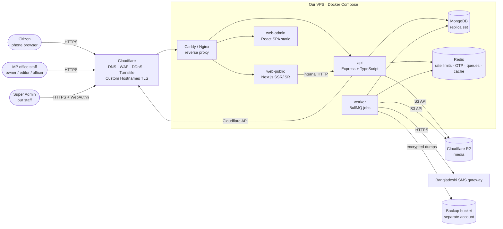
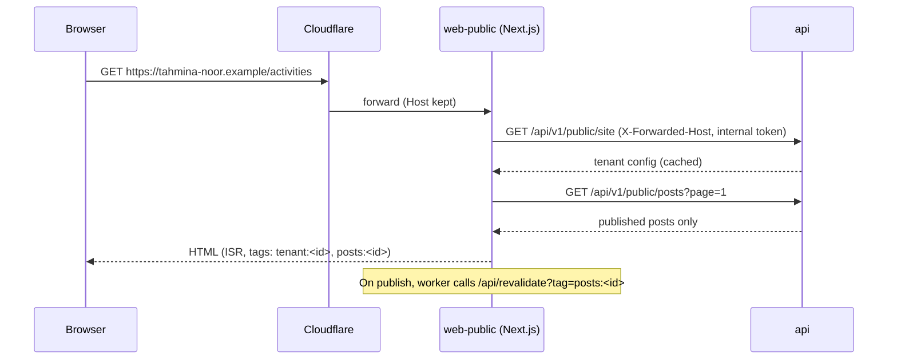
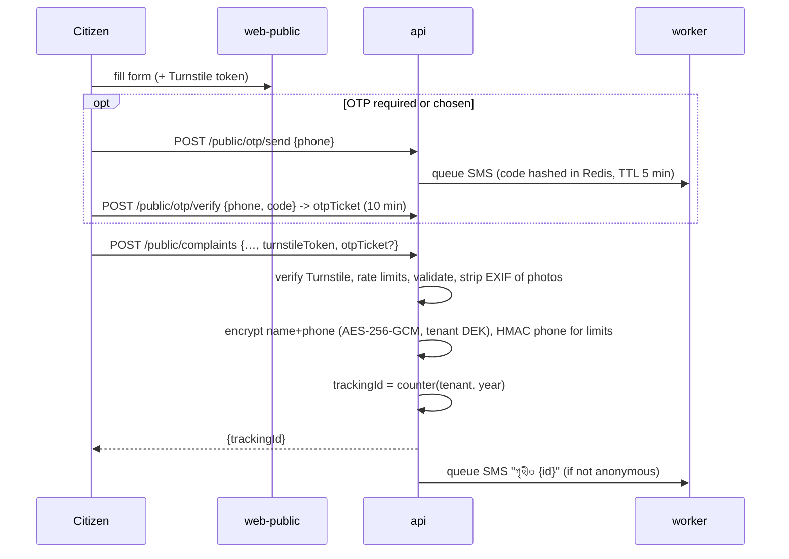

# 02 · Architecture — Jonoprotinidhi

## 1. System context

## 2. Containers

| Container | Tech | Responsibility | Scales |
|---|---|---|---|
| `web-public` | Next.js (App Router) + React, TypeScript | Renders every tenant's public site. Resolves tenant from `Host`. SSR + ISR with on-demand revalidation by cache tag. Open Graph/structured data. No secrets except an internal API token | Horizontally, stateless |
| `web-admin` | React 18 + Vite SPA, TanStack Query, React Router, React Hook Form + zod | Super Admin panel and MP Admin panel (one app, route trees by role). Served as static files from `admin.<platform-domain>` | Static |
| `api` | Node 20 LTS, Express 4 (or 5), TypeScript, Mongoose 8, zod | All business logic. REST `/api/v1`. AuthN/AuthZ, tenant scoping, audit, workflow, PII encryption | Horizontally, stateless |
| `worker` | Same codebase as `api`, BullMQ consumers | Image processing (sharp), SMS sending, scheduled publish, SLA reminders, ISR revalidation calls, domain/SSL polling, backups | Horizontally |
| `mongo` | MongoDB 7, **replica set** (even single-node) | System of record. Replica set needed for transactions and change streams | Vertical first; Atlas-compatible |
| `redis` | Redis 7 | Rate-limit counters, OTP codes (hashed, TTL), BullMQ queues, tenant-by-host cache | Single node + AOF |
| Object storage | Cloudflare R2 (S3 API) | Media originals (private bucket) and public variants (public bucket behind CDN) | Managed |
| Edge | Cloudflare | DNS, WAF, DDoS, bot management, Turnstile, **Cloudflare for SaaS custom hostnames** (TLS for MPs' own domains) | Managed |

> ARM note: our dev machines are Windows-on-ARM. All images above have arm64 builds; MongoDB server for
> local dev can run in Docker (arm64) or use a free Atlas cluster. Production VPS may be x86_64 or arm64.

## 3. Tenancy model (ADR-0001, ADR-0003, ADR-0006)

- **One database, shared collections, `tenantId` on every tenant-owned document.** Platform-level
  collections (`tenants`, `domains`, `users`, platform `auditLogs`) are not tenant-scoped.
- **Tenant resolution**
  - Public: `Host` header → `domains` lookup (cached in Redis 5 min, invalidated on change) → `tenantId`.
    Unknown host → 404 page. Suspended tenant → 503 page.
  - Admin API: path `/api/v1/admin/tenants/:tenantId/...`; middleware checks the user's `membership` for
    that tenant (or a valid act-as token for super admins) and puts `{tenantId, userId, role, perms,
    viaSuperAdmin}` into a request context (`AsyncLocalStorage`).
  - Super API: `/api/v1/super/...` requires `platformRole` and never implicitly scopes to a tenant.
- **Enforcement**: a Mongoose plugin on every tenant model reads the request context and injects
  `tenantId` into every find/update/delete/aggregate and sets it on create. If no tenant context exists and
  the query has no explicit `tenantId`, it **throws** (fail closed). Background jobs set the context
  explicitly from the job payload.
- **Tests**: an isolation suite creates two tenants and asserts that every endpoint returns 404 for the
  other tenant's IDs (see doc 05 §7).

## 4. Key request flows

### 4.1 Public page render

### 4.2 Post approval workflow (ADR-0005)
`draft --submit(editor)--> review --approve(owner)--> published | scheduled`
`review --reject(owner, reason)--> rejected --edit(editor)--> draft`
`published --unpublish(owner)--> archived`. Each transition: permission check → state check (optimistic
`version` field) → write → `postVersions` snapshot → audit log → queue `revalidate` + notifications.

### 4.3 Complaint submission

### 4.4 Act-as (super admin impersonation)
Super admin → `POST /super/tenants/:id/act-as {reason}` → short-lived (30 min) act-as token bound to the
super admin's session → admin SPA shows a red banner → every write carries `viaSuperAdmin: true` in the
audit log → PII endpoints refuse act-as tokens.

## 5. Media pipeline
1. Admin asks `POST /media/upload-url` → API returns a presigned PUT URL to the **private** R2 bucket
   (max 15 MB, image MIME allow-list).
2. Browser uploads directly; then `POST /media/:id/finalize`.
3. Worker downloads, validates magic bytes, strips EXIF/GPS, generates WebP variants (480, 960, 1280,
   1920 px) with sharp, writes them to the **public** bucket under `t/<tenantId>/<mediaId>/<w>.webp`, stores
   dimensions + blurhash, marks `ready`.
4. Public pages reference only variant URLs via the CDN domain.

## 6. Deployment

| Environment | Where | Data |
|---|---|---|
| local | Docker Compose on dev machine | Seed data = the fictional demo tenant (`client-demo/demo-mp/assets/data.js` converted by a seed script) |
| staging | Same VPS type, separate compose project and databases | Seed + anonymised copies only, never real PII |
| production | VPS (Bangladesh-friendly latency: Singapore/Mumbai region) + Cloudflare | Real |

- Deploy = CI builds images (multi-arch) → pushes to registry → `docker compose pull && up -d` on the VPS
  with health checks; migrations run as a one-off container before switching. Rollback = previous image tag.
- Secrets via env files on the host (root-only, 0600) or Docker secrets; never in the repo or images.
- Our `vps-mern-deploy` skill documents the house deploy recipe.

## 7. Cross-cutting concerns

| Concern | Approach |
|---|---|
| Caching | Next.js ISR per tenant page, revalidated by tag on publish; API response cache for public GETs in Redis (60 s); Cloudflare caches static assets and media |
| Time & locale | Store UTC; render `Asia/Dhaka`; Bangla digits and month names via shared formatter package |
| IDs | Mongo ObjectId internally; human IDs (tracking IDs, post slugs) for URLs |
| Search | Mongo text index on posts (Bangla tokenisation is weak → also prefix regex on title with escaped input); revisit Atlas Search / Meilisearch if needed |
| Email | Only for staff (transactional) via SMTP provider; citizens use SMS |
| Observability | pino JSON logs (PII redaction list), Prometheus metrics endpoint (internal), uptime checks, Sentry-compatible error tracking with PII scrubbing |

## 8. Architectural trade-offs

| Choice | Benefit | Cost / risk | Mitigation |
|---|---|---|---|
| Single shared DB with `tenantId` | Cheap, simple ops, easy cross-tenant super-admin views | One bug can leak across tenants | Fail-closed plugin + isolation tests + code review checklist |
| Next.js for public, Vite SPA for admin | SEO + link previews where they matter; simple SPA where they don't | Two front-end build setups | Shared `packages/ui-tokens`, `packages/shared` |
| Build CMS features ourselves on Express (not a headless CMS) | Matches team skills (MERN), full control of workflow/PII | More code than Payload/Strapi | Keep to the PRD; reuse patterns in doc 05 |
| Redis dependency | Correct rate limiting, OTP TTLs, reliable queues | One more service | Small, AOF persistence, health-checked |
| Cloudflare for SaaS | Automatic TLS for MPs' own domains | Vendor coupling, per-hostname fee | Abstract behind `DomainProvider` interface |
